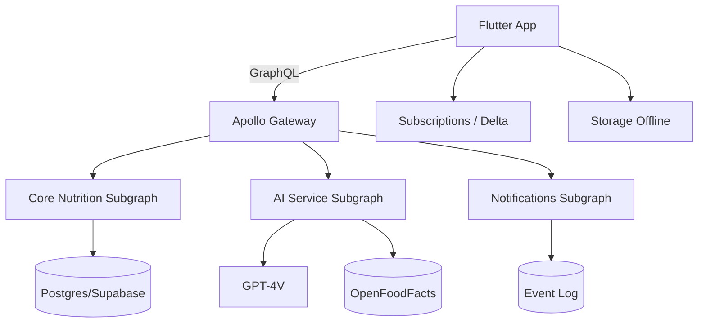

```
 _   _       _   _  __ _ _ _ _   
| \ | |_   _| |_| |/ _(_) (_) |_ 
|  \| | | | | __| | |_| | | | __|
| |\  | |_| | |_| |  _| | | | |_ 
|_| \_|\__,_|\__|_|_| |_|_|_|\__|
	 Nutrition · Fitness · AI
```

<p align="center">


<a href="https://github.com/giamma80/Nutrifit-mobile/actions/workflows/ci.yml"></a>
</p>

> Repository mobile Flutter + documentazione piattaforma (backend federato + AI pipeline) per l'ecosistema **Nutrifit**.

---
## 📚 Indice Rapido
1. [Documentazione Principale](#-documentazione-principale)
2. [Architettura High-Level](#-architettura-high-level)
3. [Feature Matrix](#-feature-matrix)
4. [Roadmap & Progress](#-roadmap--progress)
5. [Struttura Repository](#-struttura-repository)
6. [Workflow CI/CD](#-workflow-cicd)
7. [Contributi](#-contributi)
8. [Nerd Corner](#-nerd-corner)
9. [Licenza](#-licenza)

---
## 📖 Documentazione Principale
| Documento | Link | Descrizione |
|-----------|------|-------------|
| Guida Nutrizione Estesa | [docs/nutrifit_nutrition_guide.md](docs/nutrifit_nutrition_guide.md) | Dominio, formule, UX dashboard, AI pipeline |
| Architettura Mobile | [docs/mobile_architecture_plan.md](docs/mobile_architecture_plan.md) | Roadmap M0–M9, BOM, testing, performance |
| Architettura Backend | [docs/backend_architecture_plan.md](docs/backend_architecture_plan.md) | Roadmap B0–B9, federation, SLO, data model |
| Pipeline AI Food Recognition | [docs/ai_food_pipeline_README.md](docs/ai_food_pipeline_README.md) | Flusso end-to-end inference + matching |
| Prompt AI Vision | [docs/ai_food_recognition_prompt.md](docs/ai_food_recognition_prompt.md) | Prompt primario e fallback GPT-4V |
| Changelog Versioni | [CHANGELOG.md](CHANGELOG.md) | Cronologia modifiche & release semver |

---
## 🏗 Architettura High-Level


---
## ✅ Feature Matrix
| Area | MVP | v1 | v1.2 | Futuro |
|------|-----|----|------|--------|
| Logging Manuale | ✔ | ✔ | ✔ | Refinements |
| Barcode | ✔ | ✔ | ✔ | Cache avanzata |
| Foto AI | ✖ | ✔ (baseline) | ✔ (autofill) | Segmentazione on-device |
| Dashboard Giornaliera | ✔ | ✔ | ✔ | Custom layout |
| Storico Settimanale | ✖ | ✔ | ✔ | Analisi avanzate |
| Notifiche | ✖ | ✔ base | ✔ smart | Rule engine evoluto |
| Adattamento Piano | ✖ | ✖ | ✔ | ML personalization |
| Web Dashboard | ✖ | ✖ | ✔ | Admin / Analitiche |

Legenda: ✔ disponibile · ✖ non ancora · (noti) evoluzioni.

---
## 📈 Roadmap & Progress
```
Mobile   M0 ████░░░░ (20%)   → M1 → M2 → M3 ...
Backend  B0 ████░░░░ (20%)   → B1 → B2 → B3 ...
AI       POC ███░░░░ (15%)   → Baseline → Autofill
```
Dettagli granulari nelle rispettive roadmap dei documenti.

---
## 🗂 Struttura Repository (Estratto)
nutrifit_nutrition_guide.md  # Stub redirect
```
docs/                # Documentazione architettura & guide
lib/
	graphql/           # Schema, fragments, queries
	services/          # Servizi (es. food_recognition_service.dart)
	... (future features)
```

---
## 🔄 Workflow CI/CD
Planned:
- GitHub Actions: lint, analyze, schema diff, unit tests.
- Codemagic: build store (iOS/Android) + distribuzione canali.
- Backend: build Docker microservizi + deploy Render (rolling / canary AI service).

TODO: aggiungere workflow YAML (lint + schema snapshot) in `/ .github/workflows`.

---
## 🤝 Contributi
1. Fork / branch naming: `feature/<slug>` o `fix/<slug>`
2. PR checklist:
	 - [ ] Tests pass
	 - [ ] Schema GraphQL invariato (o snapshot aggiornato con nota breaking)
	 - [ ] Docs aggiornate se necessario
3. Event naming: snake_case, no payload ridondante.

---
## 🧪 Quality Gates (Target)
| Gate | Strumento | Esito Richiesto |
|------|-----------|-----------------|
| Lint | `flutter analyze` | 0 errori |
| Test | `flutter test` | ≥90% critical logic |
| Contract | schema diff | nessun breaking non documentato |
| Performance | dashboard frame time | <16ms frame hot path |

---
## 🧠 Nerd Corner
> “All models are wrong, some are useful.” — G.E.P. Box

Snippet pseudo-calcolo adattamento calorie:
```pseudo
delta_pct = clamp((trend_weight - expected)/expected, -0.15, 0.15)
new_cal = round_to_50(old_cal * (1 - delta_pct))
```

Easter Egg Roadmap: quando AI autofill >70% adoption → attivare modalità "Hyper Logging" (UI minimalista).

---
## 🗒 Changelog
Vedi [CHANGELOG.md](CHANGELOG.md). Release corrente: `v0.1.0` (baseline documentazione & schema nutrizione).

## 📝 Licenza
Da definire. (Per ora nessuna licenza pubblicata; evitare uso in produzione esterna.)

---
## 🧭 Navigazione Rapida
| Se vuoi... | Vai a |
|------------|-------|
| Capire il dominio nutrizionale | [Guida Nutrizione](docs/nutrifit_nutrition_guide.md) |
| Vedere pipeline AI cibo | [Pipeline AI](docs/ai_food_pipeline_README.md) |
| Leggere roadmap mobile | [Arch Mobile](docs/mobile_architecture_plan.md) |
| Leggere roadmap backend | [Arch Backend](docs/backend_architecture_plan.md) |
| Modificare prompt GPT-4V | [Prompt AI](docs/ai_food_recognition_prompt.md) |

