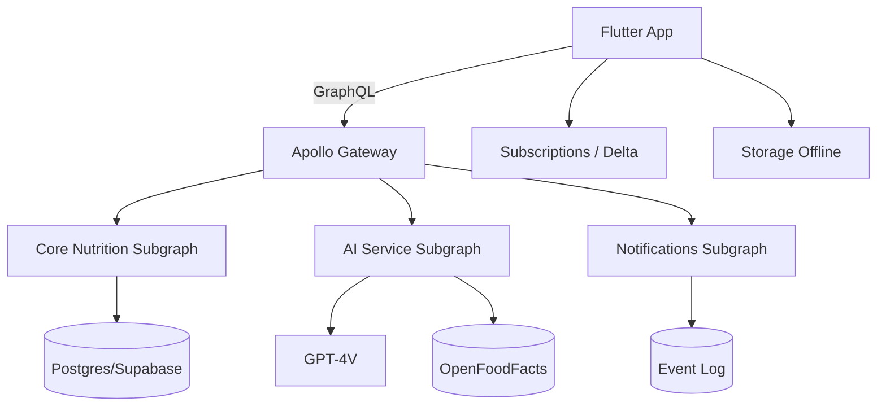

```text
 _   _       _   _  __ _ _ _ _   
| \ | |_   _| |_| |/ _(_) (_) |_ 
|  \| | | | | __| | |_| | | | __|
| |\  | |_| | |_| |  _| | | | |_ 
|_| \_|\__,_|\__|_|_| |_|_|_|\__|
  Nutrition · Fitness · AI
```

<p align="center">


 
 
<a href="https://github.com/giamma80/Nutrifit-mobile/actions/workflows/ci.yml"></a>
</p>

> Repository mobile Flutter + documentazione piattaforma (backend federato + AI pipeline) per l'ecosistema **Nutrifit**.

## 📚 Indice Rapido

1. [Documentazione Principale](#-documentazione-principale)
2. [Architettura High-Level](#-architettura-high-level)
3. [Feature Matrix](#-feature-matrix)
4. [Roadmap & Progress](#-roadmap--progress)
5. [Struttura Repository](#-struttura-repository-estratto)
6. [Workflow CI/CD](#-workflow-cicd)
7. [Contributi](#-contributi)
8. [Nerd Corner](#-nerd-corner)
9. [Licenza](#-licenza)

---
## 📖 Documentazione Principale

| Documento | Link | Descrizione |
|-----------|------|-------------|
| Guida Nutrizione Estesa | [docs/nutrifit_nutrition_guide.md](docs/nutrifit_nutrition_guide.md) | Dominio, formule, UX dashboard, AI pipeline |
| Architettura Mobile | [docs/mobile_architecture_plan.md](docs/mobile_architecture_plan.md) | Roadmap M0–M9, BOM, testing, performance |
| Architettura Backend | [docs/backend_architecture_plan.md](docs/backend_architecture_plan.md) | Roadmap B0–B9, federation, SLO, data model |
| Pipeline AI Food Recognition | [docs/ai_food_pipeline_README.md](docs/ai_food_pipeline_README.md) | Flusso end-to-end inference + matching |
| Prompt AI Vision | [docs/ai_food_recognition_prompt.md](docs/ai_food_recognition_prompt.md) | Prompt primario e fallback GPT-4V |
| Changelog Versioni | [CHANGELOG.md](CHANGELOG.md) | Cronologia modifiche & release semver |

---
## 🏗 Architettura High-Level



---
## ✅ Feature Matrix

| Area | MVP | v1 | v1.2 | Futuro |
|------|-----|----|------|--------|
| Logging Manuale | ✔ | ✔ | ✔ | Refinements |
| Barcode | ✔ | ✔ | ✔ | Cache avanzata |
| Foto AI | ✖ | ✔ (baseline) | ✔ (autofill) | Segmentazione on-device |
| Dashboard Giornaliera | ✔ | ✔ | ✔ | Custom layout |
| Storico Settimanale | ✖ | ✔ | ✔ | Analisi avanzate |
| Notifiche | ✖ | ✔ base | ✔ smart | Rule engine evoluto |
| Adattamento Piano | ✖ | ✖ | ✔ | ML personalization |
| Web Dashboard | ✖ | ✖ | ✔ | Admin / Analitiche |

Legenda: ✔ disponibile · ✖ non ancora · (noti) evoluzioni.

---
## 📈 Roadmap & Progress

```text
Mobile   M0 ████░░░░ (20%)   → M1 → M2 → M3 ...
Backend  B0 ████░░░░ (20%)   → B1 → B2 → B3 ...
AI       POC ███░░░░ (15%)   → Baseline → Autofill
```
Dettagli granulari nelle rispettive roadmap dei documenti.

---
## 🗂 Struttura Repository (Estratto)

nutrifit_nutrition_guide.md  # Stub redirect

```text
docs/                # Documentazione architettura & guide
lib/
  graphql/           # Schema, fragments, queries
  services/          # Servizi (es. food_recognition_service.dart)
  ... (future features)
```

---
## 🔄 Workflow CI/CD
Planned:
- GitHub Actions: lint, analyze, schema diff, unit tests.
- Codemagic: build store (iOS/Android) + distribuzione canali.
- Backend: build Docker microservizi + deploy Render (rolling / canary AI service).

TODO: aggiungere workflow YAML (lint + schema snapshot) in `/ .github/workflows`.

### Backend (uv + Docker) Quick Start
Opzione A (nativo):
```bash
cd backend
uv sync --all-extras --dev
uv run uvicorn app:app --reload --port 8080
```
Opzione B (script helper):
```bash
cd backend
./make.sh setup
./make.sh run
```
Opzione B2 (alias Makefile — equivalente):
```bash
cd backend
make setup
make run
make help   # mostra elenco target cockpit
```
Opzione C (Docker):
```bash
docker build -t nutrifit-backend:dev backend
docker run -p 8080:8080 nutrifit-backend:dev
```
Endpoints: `GET /health`, `GET /version`, `POST /graphql` (query demo `hello`, `server_time`).

Differenza rapida ambiente:

| Ambiente | Comando principale | Reload automatico | Isolamento | Uso tipico |
|----------|-------------------|-------------------|------------|-----------|
| Locale (uv) | `./make.sh run` | Sì (`--reload`) | Virtual env | Dev iterativo |
| Docker | `./make.sh docker-run` | No (ricostruire) | Immagine | Parità prod / test container |

Pipeline Deploy: push -> GitHub Action (`backend-ci`) valida (lint, type-check, test, docker build) -> Render ricostruisce immagine dal `backend/Dockerfile` e avvia `uvicorn`.

#### Preflight & Quality Gates
Il comando `./make.sh preflight` esegue in sequenza i gate e produce un riepilogo finale tabellare:

Gates controllati:

| Gate | Contenuto | Critico per exit code |
|------|-----------|-----------------------|
| format | Black (non blocca) | No |
| lint | Flake8 + Mypy | Sì |
| tests | Pytest suite | Sì |
| schema | Diff SDL GraphQL | Sì |
| commitlint | Convenzioni commit | No (WARN/SKIP) |

Stati possibili:

| Stato | Significato |
|-------|------------|
| PASS | Tutto ok |
| FAIL | Gate critico fallito (preflight termina 1) |
| WARN | Commitlint non conforme ma non blocca |
| SKIP | Gate non eseguito (dipendenze assenti / opzionale) |

Esempio output:
```text
=== Preflight Summary ===
GATE         | ESITO  | NOTE
format       | PASS   |
lint         | PASS   |
tests        | PASS   |
schema       | PASS   |
commitlint   | SKIP   | deps mancanti
```

Suggerito prima di ogni commit/push per feedback rapido locale.

#### Flusso Commit & Push
Passi consigliati (dalla cartella `backend/`):
```bash
./make.sh preflight             # verifica qualità
./make.sh commit MSG="feat(adapter): retry OFF"  # esegue preflight + commit
./make.sh push                  # preflight + push remoto
```
Oppure manuale:
```bash
./make.sh preflight
git add .
git commit -m "feat(adapter): retry OFF"
git push
```

#### Bump Versione & Release
Per creare una release semver (aggiorna `pyproject.toml`, tag e changelog):
```bash
./make.sh release LEVEL=patch   # o minor / major
```
Flow interno:
1. Preflight
2. Calcolo nuova versione
3. Finalizzazione CHANGELOG (sezione Unreleased -> nuova versione)
4. Commit + tag `vX.Y.Z`
5. Push + push tag

Per solo bump senza publish changelog finale:
```bash
./make.sh version-bump LEVEL=minor
```

Verifica corrispondenza versione/tag:
```bash
./make.sh version-verify
```

#### Log locale backend
Lo script `backend/make.sh` scrive i log runtime in `backend/logs/server.log` (ignorato da git). Usa:
```bash
cd backend
./make.sh run-bg   # avvio in background
./make.sh logs     # tail -f del file
./make.sh stop     # termina e annota STOP
```
Ogni riavvio aggiunge marker temporalizzati per facilitare il debug.

### Commitlint
Ogni PR esegue verifica convenzioni commit (`feat:`, `fix:`, `docs:`...). Per test locale:
```bash
npx commitlint --from=origin/main --to=HEAD --verbose
```

### Offline Meal Queue (WIP)
Struttura futura in `lib/offline/` con coda persistente (Hive) e replay verso mutation `logMeal`. Placeholder ancora non implementato.

### OpenFoodFacts Adapter
Implementato adapter asincrono (`backend/openfoodfacts/adapter.py`) con normalizzazione nutrienti (fallback kJ→kcal, derivazione sodio da sale).

#### Retry & Timeout Strategy
Il client effettua richieste con timeout totale `TIMEOUT_S=8s` e semplice meccanismo di retry esponenziale:

| Parametro | Valore | Note |
|-----------|--------|------|
| MAX_RETRIES | 3 | Inclusa la prima richiesta (quindi 1 + 2 retry) |
| INITIAL_BACKOFF_S | 0.2s | Cresce in modo esponenziale (x2) ad ogni retry |
| BACKOFF_FACTOR | 2.0 | 0.2 → 0.4 → 0.8 |
| RETRY_STATUS_CODES | 500, 502, 503, 504 | Altri 5xx vengono trattati come errore diretto |
| Eccezioni rete | ReadTimeout, ConnectError, RemoteProtocolError, NetworkError | Stesso flusso dei 5xx retryable |

Condizioni di uscita:

1. 404 → `ProductNotFound` (no retry)
2. `status != 1` nel payload → `ProductNotFound`
3. 5xx retryable → retry fino a cap, poi `OpenFoodFactsError`
4. Timeout / errori rete consecutivi → `OpenFoodFactsError` dopo esaurimento tentativi

I test includono casi: successo base, fallback kJ, conversione sale→sodio, nutrienti invalidi, 404, 500 singolo, 500 transiente risolto, timeout transiente, esaurimento retry 500, esaurimento retry timeout.

Futuri possibili miglioramenti:

- Jitter random sul backoff per ridurre sincronizzazione a storm
- Cache LRU locale per barcode già risolti
- Circuit breaker con finestra di errore
- Metriche (counter tentativi / failure) esportate in endpoint interno


### Rule Engine DSL (Draft)
Specifica iniziale e parser YAML per regole notifiche/adattamento (file: `docs/rule_engine_DSL.md`, parser: `backend/rules/parser.py`). Supporta trigger `schedule|event`, condizioni base (deviazione calorie, nessun pasto finestra) e azioni (`push_notification`, `adjust_plan_targets`).

---
## 🤝 Contributi

1. Fork / branch naming: `feature/<slug>` o `fix/<slug>`
2. PR checklist:
   - [ ] Tests pass
   - [ ] Schema GraphQL invariato (o snapshot aggiornato con nota breaking)
   - [ ] Docs aggiornate se necessario
3. Event naming: snake_case, no payload ridondante.

---
## 🧪 Quality Gates (Target)

| Gate | Strumento | Esito Richiesto |
|------|-----------|-----------------|
| Lint | `flutter analyze` | 0 errori |
| Test | `flutter test` | ≥90% critical logic |
| Contract | schema diff | nessun breaking non documentato |
| Performance | dashboard frame time | <16ms frame hot path |

---
## 🧠 Nerd Corner
> “All models are wrong, some are useful.” — G.E.P. Box

Snippet pseudo-calcolo adattamento calorie:
```text
delta_pct = clamp((trend_weight - expected)/expected, -0.15, 0.15)
new_cal = round_to_50(old_cal * (1 - delta_pct))
```

Easter Egg Roadmap: quando AI autofill >70% adoption → attivare modalità "Hyper Logging" (UI minimalista).

---
## 🗒 Changelog
Vedi [CHANGELOG.md](CHANGELOG.md). Release corrente backend: `v0.1.3` (cockpit script, logging, bump tooling aggiornati).

Quick check versione backend da root (senza entrare in `backend/`):
```bash
cd backend && ./make.sh version-show
```
Altri comandi utili backend:
```bash
./make.sh version-verify   # controlla match tag HEAD vs pyproject
./make.sh schema-export    # genera/aggiorna SDL GraphQL
./make.sh schema-check     # verifica che lo schema versionato sia aggiornato
```
Suggerimento: per utenti junior basta ricordare la sequenza:
```bash
cd backend
make setup   # o ./make.sh setup
make run     # avvia server
make preflight   # prima di fare commit/push
```

Il badge `backend_version` sopra viene aggiornato automaticamente dal workflow
`update-backend-version-badge.yml` quando cambia `backend/pyproject.toml`.

## 📝 Licenza
Da definire. (Per ora nessuna licenza pubblicata; evitare uso in produzione esterna.)

---
## 🧭 Navigazione Rapida

| Se vuoi... | Vai a |
|------------|-------|
| Capire il dominio nutrizionale | [Guida Nutrizione](docs/nutrifit_nutrition_guide.md) |
| Vedere pipeline AI cibo | [Pipeline AI](docs/ai_food_pipeline_README.md) |
| Leggere roadmap mobile | [Arch Mobile](docs/mobile_architecture_plan.md) |
| Leggere roadmap backend | [Arch Backend](docs/backend_architecture_plan.md) |
| Modificare prompt GPT-4V | [Prompt AI](docs/ai_food_recognition_prompt.md) |

