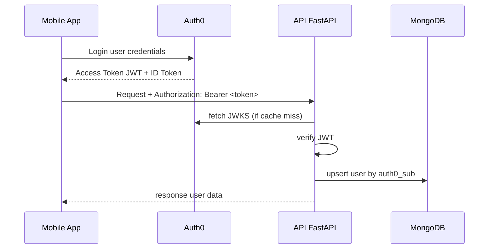

# User Management — Specifica e Implementazione (Aggiornata con Middleware e Auth0)

Documento contenente tutto il necessario per implementare il dominio `user` per la tua applicazione mobile.
Include: schema MongoDB, comandi da eseguire, istruzioni Auth0, modelli Pydantic, middleware per validazione JWT, resolver Strawberry, API CRUD REST (FastAPI + Motor), e un sequence diagram (Mermaid).

---

## Sommario

1. Obiettivi
2. Schema collection users (JSON Schema + comandi Mongo)
3. Indici consigliati
4. Istruzioni su Auth0 (API, claims, Management API)
5. Middleware FastAPI per verifica JWT (auth_middleware.py) — integrazione REST + GraphQL
6. Modelli Pydantic (models.py)
7. REST CRUD (FastAPI + Motor) (users_api.py)
8. GraphQL (Strawberry) — context getter + resolver (graphql_users.py)
9. Sequence diagram (Mermaid)
10. Configurazione `.env` e feature flag
11. Checklist di deployment e note operative
12. Suggerimenti e possibili estensioni

---

## 1) Obiettivi

* Fornire una collection MongoDB `users` con validazione e indici.
* Usare **Auth0** come provider d’identità principale (nessuna password memorizzata nel backend).
* Minimizzare le modifiche sugli endpoint esistenti usando **un middleware globale** che popola `request.state.user`.
* Esporre sia REST CRUD sia GraphQL (Strawberry) per lettura/scrittura del profilo utente.
* Permettere un **feature flag** per disattivare temporaneamente l’autenticazione (utile per sviluppo/testing).

---

## 2) Schema collection users (JSON Schema)

```json
{
  "bsonType": "object",
  "required": ["auth0_sub","email","email_verified","created_at","updated_at"],
  "properties": {
    "auth0_sub": { "bsonType": "string" },
    "email": { "bsonType": "string", "pattern": "^.+@.+\\..+$" },
    "email_verified": { "bsonType": "bool" },
    "userid": { "bsonType": ["string","null"] },
    "name": { "bsonType": ["string","null"] },
    "given_name": { "bsonType": ["string","null"] },
    "family_name": { "bsonType": ["string","null"] },
    "picture": { "bsonType": ["string","null"] },
    "phone": { "bsonType": ["string","null"] },
    "locale": { "bsonType": ["string","null"] },
    "roles": { "bsonType": ["array"], "items": { "bsonType": "string" } },
    "metadata": { "bsonType": ["object","null"] },
    "preferences": { "bsonType": ["object","null"] },
    "disabled": { "bsonType": "bool" },
    "last_login": { "bsonType": ["date","null"] },
    "created_at": { "bsonType": "date" },
    "updated_at": { "bsonType": "date" },
    "profile_version": { "bsonType": "int" },
    "custom_claims": { "bsonType": ["object","null"] }
  }
}
```

Creazione collection MongoDB:

```javascript
db.createCollection("users", {
  validator: { $jsonSchema: <above_schema> },
  validationLevel: "moderate"
});
```

---

## 3) Indici consigliati

```javascript
db.users.createIndex({ auth0_sub: 1 }, { unique: true });
db.users.createIndex({ email: 1 }, { unique: true, sparse: true });
db.users.createIndex({ userid: 1 }, { unique: true, sparse: true });
db.users.createIndex({ roles: 1 });
db.users.createIndex({ last_login: -1 });
```

* `sparse: true` permette record senza email o userid.
* Considerare TTL index per sessioni temporanee in collezioni separate.

---

## 4) Istruzioni su Auth0

### A) Creare una API in Auth0

* Vai su APIs → Create API.
* Name: `my-app-api`
* Identifier → stringa da usare come AUDIENCE (`https://api.myapp.local`).
* Algoritmo: RS256.

### B) Configurare la Mobile App

* Creare una Application (Native/SPA).
* Configura callback URL, logout URL, allowed origins.
* Richiedere Access Token con audience impostata sull’API.

### C) Ruoli / Claims

* Mapparli in custom claim (namespace URL) via Action/Rule:

```javascript
exports.onExecutePostLogin = async (event, api) => {
  const namespace = 'https://myapp.example.com/';
  const roles = (event.authorization || {}).roles || [];
  api.idToken.setCustomClaim(namespace + 'roles', roles);
  api.accessToken.setCustomClaim(namespace + 'roles', roles);
};
```

### D) Management API (opzionale)

* Machine-to-Machine App con permessi read/update su `users`.
* Client ID/Secret per token server-to-server.

### E) Token JWT

* Assicurarsi che Access Token sia JWT e audience corrispondente.
* Backend può interrogare `/userinfo` se necessario.

### F) Processo di autenticazione client

1. Il client mobile fa login con Auth0 (SDK o Universal Login).
2. Riceve Access Token JWT + ID Token.
3. Invia richieste REST/GraphQL con header `Authorization: Bearer <token>`.
4. Il middleware verifica il JWT, popola `request.state.user`.
5. Endpoints REST/GraphQL leggono `request.state.user` senza modifiche ulteriori.

---

## 5) Middleware FastAPI (auth_middleware.py)

* Middleware globale verifica JWT, decodifica con JWKS di Auth0, upserta user in MongoDB.
* Legge feature flag per decidere se applicare autenticazione.

```python
import os
from fastapi import Request
from starlette.middleware.base import BaseHTTPMiddleware
from jose import jwt
import requests
from datetime import datetime

AUTH0_DOMAIN = os.getenv("AUTH0_DOMAIN")
API_AUDIENCE = os.getenv("API_AUDIENCE")
ALGORITHMS = ["RS256"]
AUTH_ENABLED = os.getenv("AUTH_ENABLED", "true").lower() == "true"

_jwks = None

def get_jwks():
    global _jwks
    if _jwks is None:
        jwks_url = f"https://{AUTH0_DOMAIN}/.well-known/jwks.json"
        r = requests.get(jwks_url, timeout=5)
        r.raise_for_status()
        _jwks = r.json()
    return _jwks

class AuthMiddleware(BaseHTTPMiddleware):
    def __init__(self, app, users_col=None, require_valid_token=True):
        super().__init__(app)
        self.users_col = users_col
        self.require_valid_token = require_valid_token

    async def dispatch(self, request: Request, call_next):
        if not AUTH_ENABLED:
            request.state.user = None
            return await call_next(request)

        auth = request.headers.get("Authorization")
        request.state.user = None

        if auth and auth.startswith("Bearer "):
            token = auth.split(" ", 1)[1]
            try:
                payload = verify_token(token)
                user = {"auth0_sub": payload.get("sub"), "email": payload.get("email"), "claims": payload}
                request.state.user = user

                # Upsert in DB
                if self.users_col and user.get("auth0_sub"):
                    now = datetime.utcnow()
                    await self.users_col.update_one({"auth0_sub": user["auth0_sub"]},
                        {"$set": {"email": user.get("email"), "updated_at": now},
                         "$setOnInsert": {"created_at": now}},
                        upsert=True)
            except Exception:
                request.state.user = None
                if self.require_valid_token:
                    from starlette.responses import JSONResponse
                    return JSONResponse({"detail": "Invalid token"}, status_code=401)

        return await call_next(request)
```

* Tutti gli endpoint REST/GraphQL leggono `request.state.user` senza cambiare firma.

---

## 6) Modelli Pydantic (models.py)

Salva questo file nel progetto Python (es. `app/models.py`).

```python
# models.py
from pydantic import BaseModel, EmailStr, Field
from typing import Optional, List, Dict, Any
from datetime import datetime
from bson import ObjectId

class PyObjectId(str):
    """Placeholder wrapper. Implement proper validation if desideri."""
    pass

class UserInDB(BaseModel):
    id: Optional[PyObjectId] = Field(None, alias="_id")
    auth0_sub: str
    email: Optional[EmailStr] = None
    email_verified: bool = False
    userid: Optional[str] = None
    name: Optional[str] = None
    given_name: Optional[str] = None
    family_name: Optional[str] = None
    picture: Optional[str] = None
    phone: Optional[str] = None
    locale: Optional[str] = None
    roles: List[str] = []
    metadata: Optional[Dict[str, Any]] = {}
    preferences: Optional[Dict[str, Any]] = {}
    disabled: bool = False
    last_login: Optional[datetime] = None
    created_at: datetime
    updated_at: datetime
    profile_version: int = 1
    custom_claims: Optional[Dict[str, Any]] = None

    class Config:
        allow_population_by_field_name = True
        json_encoders = {ObjectId: str}
```

Se desideri serializzare ObjectId in modo rigoroso, aggiungi metodi di validazione per `PyObjectId`.

---

## 5) Middleware FastAPI per verifica JWT (`auth_middleware.py`)

Questo middleware verifica il token (se presente), lo decodifica tramite JWKS di Auth0 e inietta `request.state.user`.

```python
# auth_middleware.py
from fastapi import Request
from starlette.middleware.base import BaseHTTPMiddleware
from jose import jwt
import requests
from datetime import datetime

AUTH0_DOMAIN = "YOUR_AUTH0_DOMAIN"  # es. 'dev-xxxxx.us.auth0.com'
API_AUDIENCE = "YOUR_API_AUDIENCE"  # es. 'https://api.myapp.local'
ALGORITHMS = ["RS256"]

_jwks = None

def get_jwks():
    global _jwks
    if _jwks is None:
        jwks_url = f"https://{AUTH0_DOMAIN}/.well-known/jwks.json"
        r = requests.get(jwks_url, timeout=5)
        r.raise_for_status()
        _jwks = r.json()
    return _jwks

def verify_token(token: str):
    jwks = get_jwks()
    unverified_header = jwt.get_unverified_header(token)
    rsa_key = None
    for key in jwks.get("keys", []):
        if key.get("kid") == unverified_header.get("kid"):
            rsa_key = {"kty": key["kty"], "kid": key["kid"], "use": key["use"], "n": key["n"], "e": key["e"]}
            break
    if not rsa_key:
        raise Exception("JWKS key not found")

    payload = jwt.decode(
        token,
        rsa_key,
        algorithms=ALGORITHMS,
        audience=API_AUDIENCE,
        issuer=f"https://{AUTH0_DOMAIN}/"
    )
    return payload

class AuthMiddleware(BaseHTTPMiddleware):
    def __init__(self, app, users_col=None, require_valid_token=False):
        super().__init__(app)
        self.users_col = users_col
        self.require_valid_token = require_valid_token

    async def dispatch(self, request: Request, call_next):
        auth = request.headers.get("Authorization")
        request.state.user = None
        if auth and auth.startswith("Bearer "):
            token = auth.split(" ", 1)[1]
            try:
                payload = verify_token(token)
                # minimal user object
                user = {
                    "auth0_sub": payload.get("sub"),
                    "email": payload.get("email"),
                    "claims": payload
                }
                request.state.user = user

                # optional: upsert in DB on first encounter
                if self.users_col is not None and user.get("auth0_sub"):
                    now = datetime.utcnow()
                    doc = {
                        "auth0_sub": user["auth0_sub"],
                        "email": user.get("email"),
                        "email_verified": payload.get("email_verified", False),
                        "name": payload.get("name"),
                        "updated_at": now,
                        "$setOnInsert": {"created_at": now}
                    }
                    # use update_one with upsert
                    await self.users_col.update_one({"auth0_sub": user["auth0_sub"]}, {"$set": doc, "$setOnInsert": {"created_at": now}}, upsert=True)

            except Exception:
                request.state.user = None
                if self.require_valid_token:
                    # if you want to force 401 globally, raise here (but prefer per-route control)
                    from starlette.responses import JSONResponse
                    return JSONResponse({"detail": "Invalid token"}, status_code=401)

        response = await call_next(request)
        return response
```

**Note operative**:

* In fase di sviluppo metti `AUTH0_DOMAIN` e `API_AUDIENCE` via ENV vars.
* Considera un meccanismo di cache con TTL per `_jwks` e gestione della rotazione.
* Il middleware non cambia la firma delle route: i tuoi endpoint leggono `request.state.user`.

---

## 7) REST CRUD (users_api.py)

Esempio minimale che sfrutta `request.state.user` (non obbliga a passare token come parametro di funzione):

```python
# users_api.py
from fastapi import APIRouter, Request, HTTPException, Depends
from datetime import datetime
from pydantic import BaseModel

router = APIRouter()

class UserPatch(BaseModel):
    userid: Optional[str] = None
    name: Optional[str] = None
    picture: Optional[str] = None
    preferences: Optional[dict] = None

@router.post("/users/")
async def create_or_update_user(request: Request, payload: dict):
    users_col = request.app.state.db.get_collection("users")
    auth0_sub = payload.get("auth0_sub")
    if not auth0_sub:
        raise HTTPException(status_code=400, detail="auth0_sub required")
    now = datetime.utcnow()
    payload["updated_at"] = now
    payload.setdefault("created_at", now)
    await users_col.update_one({"auth0_sub": auth0_sub}, {"$set": payload}, upsert=True)
    user = await users_col.find_one({"auth0_sub": auth0_sub})
    user["_id"] = str(user["_id"])
    return user

@router.get("/users/me")
async def get_me(request: Request):
    user = getattr(request.state, "user", None)
    if not user:
        raise HTTPException(status_code=401, detail="Not authenticated")
    users_col = request.app.state.db.get_collection("users")
    u = await users_col.find_one({"auth0_sub": user["auth0_sub"]})
    if not u:
        raise HTTPException(status_code=404, detail="User not found")
    u["_id"] = str(u["_id"])
    return u

@router.patch("/users/me")
async def patch_me(request: Request, patch: UserPatch):
    user = getattr(request.state, "user", None)
    if not user:
        raise HTTPException(status_code=401)
    users_col = request.app.state.db.get_collection("users")
    data = patch.dict(exclude_unset=True)
    data["updated_at"] = datetime.utcnow()
    await users_col.update_one({"auth0_sub": user["auth0_sub"]}, {"$set": data})
    u = await users_col.find_one({"auth0_sub": user["auth0_sub"]})
    u["_id"] = str(u["_id"])
    return u

@router.delete("/users/me")
async def delete_me(request: Request):
    user = getattr(request.state, "user", None)
    if not user:
        raise HTTPException(status_code=401)
    users_col = request.app.state.db.get_collection("users")
    res = await users_col.delete_one({"auth0_sub": user["auth0_sub"]})
    return {"deleted": res.deleted_count == 1}
```

**Note:** monta questo router nell'app principale e assicurati che `app.state.db` sia inizializzato (es. con Motor) e che `AuthMiddleware` sia aggiunto al FastAPI app.

---

## 8) GraphQL (Strawberry) — `graphql_users.py`

*(context getter legge `current_user` da `request.state.user`)*

Impostazione di `context_getter` per popolare `current_user` usando `request.state.user` (middleware):

```python
# graphql_users.py
import strawberry
from typing import Optional, List
from datetime import datetime
from strawberry.fastapi import GraphQLRouter
from fastapi import Request

@strawberry.type
class UserType:
    auth0_sub: str
    email: Optional[str]
    userid: Optional[str]
    name: Optional[str]
    roles: Optional[List[str]]
    created_at: Optional[datetime]

@strawberry.type
class Query:
    @strawberry.field
    async def me(self, info) -> Optional[UserType]:
        request: Request = info.context["request"]
        user = info.context.get("current_user")
        if not user:
            return None
        users_col = request.app.state.db.get_collection("users")
        u = await users_col.find_one({"auth0_sub": user["auth0_sub"]})
        if not u:
            return None
        return UserType(
            auth0_sub=u["auth0_sub"],
            email=u.get("email"),
            userid=u.get("userid"),
            name=u.get("name"),
            roles=u.get("roles", []),
            created_at=u.get("created_at")
        )

schema = strawberry.Schema(Query)

async def get_context(request: Request):
    # request.state.user è stato settato dal middleware globale; se non usi il middleware
    # puoi ripetere la verifica del token qui.
    return {"request": request, "current_user": getattr(request.state, "user", None)}

graphql_app = GraphQLRouter(schema, context_getter=get_context)
```

**Nota**: i resolver non cambiano firma e leggono `info.context["current_user"]` quando necessario.

---

## 9) Sequence diagram (Mermaid)



---

## 10) Configurazione `.env` e feature flag

```env
# Auth0 configuration
AUTH0_DOMAIN=dev-xxxxx.us.auth0.com
API_AUDIENCE=https://api.myapp.local
AUTH_ENABLED=true  # true: autenticazione attiva, false: API pubbliche senza auth

# MongoDB
MONGO_URI=mongodb://localhost:27017/myapp
```

---

## 11) Checklist di deployment e note operative

* [ ] Impostare ENV var: `AUTH0_DOMAIN`, `API_AUDIENCE`, `MONGO_URI`, `AUTH_ENABLED`
* [ ] Creare la collection `users` in Mongo con JSON Schema
* [ ] Creare indici raccomandati
* [ ] Implementare e attivare `AuthMiddleware` prima di includere router REST/GraphQL
* [ ] Configurare Auth0: API (audience), App (client), Action/Rule per roles
* [ ] Test login mobile → chiamata `/users/me` REST e Query `me` GraphQL
* [ ] Gestire rotazione JWKS con cache TTL e retry
* [ ] Non memorizzare token sensibili nel DB

---

## 12) Suggerimenti e possibili estensioni

* Webhooks/Auth0 Actions per sincronizzazioni in realtime (`user.created`, `user.updated`).
* Audit: collection `user_audit` per tracciare modifiche sensibili.
* Rate limiting per proteggere endpoint pubblici e sensibili.
* Possibile meccanismo fallback se Auth0 non raggiungibile (solo per sviluppo).
