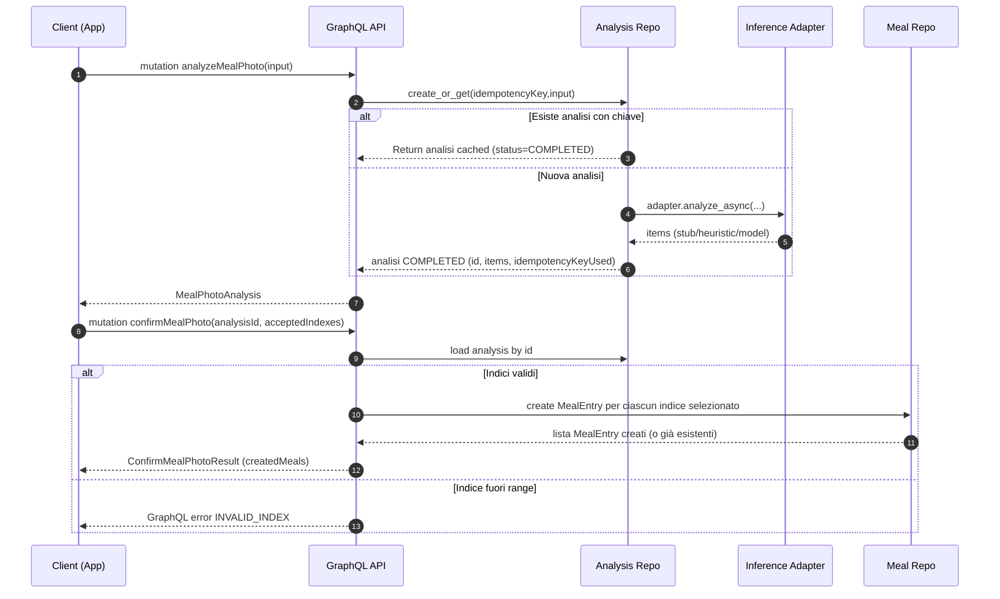

# AI Meal Photo – Flusso Analyze & Confirm

## Obiettivo
Fornire un flusso a due step sicuro, idempotente e osservabile per trasformare una foto (o URL) del pasto in:
1. Analisi preliminare (items proposti + nutrienti stimati preliminari)
2. Conferma esplicita dell’utente che genera effettivi MealEntry persistiti

Questo separa la fase “AI / suggerimento” dalla fase di “commit nutrizionale” nel diario alimentare.

## Sommario
1. Perché due mutazioni?
2. Schema & Tipi rilevanti
3. Idempotenza & Chiavi
4. Sequence Diagram (Analyze → Confirm)
5. Conciliamento tra `analyzeMealPhoto` e `confirmMealPhoto`
6. Regole di validazione conferma
7. Errori e fallback
8. Esempi GraphQL
9. Estensioni pianificate

---
## 1. Perché due mutazioni?
Un singolo step sarebbe più rapido ma accoppia UI, AI e persistenza. Lo split porta vantaggi:
- UX iterativa (l’utente può deselezionare item, modificare quantità in futuro)
- Possibilità di arricchimento asincrono (futuro: portion inference, macro refinement)
- Possibilità di salvare stato FAILED / PENDING senza creare side‑effects nel diario
- Prevenzione di log duplicati grazie a idempotenza dell’analisi

---
## 2. Schema & Tipi rilevanti (estratto)
```graphql
mutation analyzeMealPhoto($input: AnalyzeMealPhotoInput!) {
  analyzeMealPhoto(input: $input) {
    id
    status
    items { label confidence quantityG calories }
    idempotencyKeyUsed
    analysisErrors { code message severity }
  }
}

mutation confirmMealPhoto($input: ConfirmMealPhotoInput!) {
  confirmMealPhoto(input: $input) {
    analysisId
    createdMeals { id name calories quantityG }
  }
}
```
Tipi principali: `MealPhotoAnalysis`, `MealPhotoItemPrediction`, `ConfirmMealPhotoResult`.

---
## 3. Idempotenza & Chiavi
`analyzeMealPhoto` accetta opzionalmente `idempotencyKey`.
- Se non fornita: generata come `auto-<sha256(user|photoId|photoUrl)[:16]>`
- Stessa chiave + stessi input → ritorna identico oggetto (stesso `id`) senza rieseguire inference
- Il campo `idempotencyKeyUsed` permette alla UI di capire se un’analisi è stata “riusata”

`confirmMealPhoto` non è idempotent by key, ma idempotente rispetto allo stesso `analysisId`:
- Ripetere la conferma con gli stessi indici non crea duplicati (repository controlla già i MealEntry). 

---
## 4. Sequence Diagram


---
## 5. Conciliamento Analyze vs Confirm
Le due fasi sono coerenti tramite l’`analysisId`:
- `analyzeMealPhoto` produce un identificatore stabile + lista ordered di item candidati
- La UI mostra i candidati e permette selezione (array di indici)
- `confirmMealPhoto` risolve l’`analysisId`, valida che gli indici richiesti esistano e crea i corrispondenti MealEntry (nutritional snapshot derivato dai campi dell’item)
- Nessuna mutazione diretta sugli item analizzati: se in futuro la UI vuole modificare quantità, userà mutazioni di update sul MealEntry creato

### Idempotenza conferma
Se la conferma viene inviata due volte con gli stessi indici:
- Il repository restituisce gli stessi MealEntry (non duplica)
- Questo è importante per reti instabili / retry lato client

### Gestione errori conferma
- Se un indice è fuori range → errore `INVALID_INDEX` (GraphQL error list)
- Se l’`analysisId` non esiste → errore `NOT_FOUND`

---
## 6. Regole di validazione conferma
| Regola | Azione | Tipo errore |
|--------|--------|-------------|
| `analysisId` inesistente | Abort | NOT_FOUND |
| Lista `acceptedIndexes` vuota | Consente (crea 0 pasti) | Nessun errore |
| Indice < 0 o >= len(items) | Abort | INVALID_INDEX |
| Doppione in `acceptedIndexes` | Ignorato (dedup) | Nessun errore |

---
## 7. Errori e fallback (fase analyze)
Gli errori di inference non bloccano la mutation se è possibile fornire un output degradato:
- Fallback GPT‑4V → stub o heuristic
- Parsing fallito → Items stub + motivo in `analysisErrors`
- Solo in futuro (status != COMPLETED) verranno introdotti `FAILED`/`PENDING`

Campi diagnostici:
- `analysisErrors[]` (codice + message + severity)
- `failureReason` (quando status finale ≠ COMPLETED)

---
## 8. Esempi GraphQL
### Analyze (senza chiave esplicita)
```graphql
mutation {
  analyzeMealPhoto(input:{photoId:"ph1"}) {
    id
    items { label confidence quantityG }
    idempotencyKeyUsed
  }
}
```

### Confirm (accetta tutti gli item)
```graphql
mutation Confirm($id: ID!) {
  confirmMealPhoto(input:{analysisId:$id, acceptedIndexes:[0,1]}) {
    analysisId
    createdMeals { id name calories quantityG }
  }
}
```

---
## 9. Estensioni pianificate
| Feature | Descrizione | Impatto |
|---------|-------------|---------|
| Stato PENDING/stream | Streaming parziale dell’analisi, UI progressiva | Richiede storage incrementale |
| Portion refinement | Seconda pass con modello dedicato porzioni | Campo extra negli item |
| Enrichment macro | Integrazione con nutrient database per macro dettagliate | Aumento campi MealEntry |
| Barcode fusion | Se foto include barcode, merge con prodotto esistente | Regole di precedence |
| Revisioni | Ri‑analisi di un’analisi precedente con versione modello diversa | Versioning analisi |

---
## Cross-link
Altri documenti correlati:
- `docs/ai_meal_photo_metrics.md`: metriche, fallback e error taxonomy
- `docs/ai_food_pipeline_README.md`: roadmap pipeline visione (quando introdotta)
- `docs/ai_meal_photo_errors.md`: elenco codici errore dettagliati (se presente)

---
## Changelog
- v1: Documento iniziale (two‑step flow + sequence diagram)
