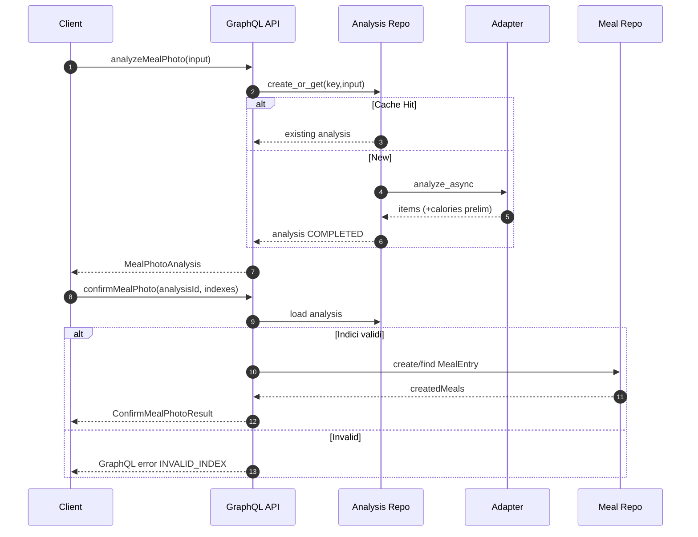
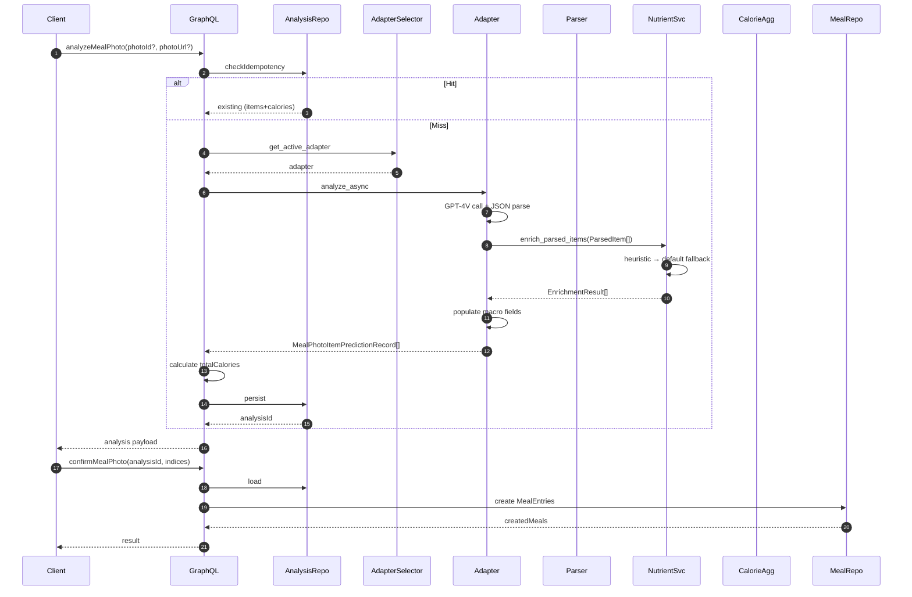

# AI Meal Photo – Evoluzione, Flusso Two‑Step & Calorie

Documenti correlati: 
- [Pipeline AI Food Recognition](ai_food_pipeline_README.md)
- [Prompt GPT-4V Draft](ai_food_recognition_prompt.md)
- [Error Taxonomy](ai_meal_photo_errors.md)
- [Metriche & Fallback](../backend/docs/ai_meal_photo_metrics.md)

## Obiettivo
Ridurre l'attrito nella registrazione dei pasti offrendo un flusso rapido foto → suggerimenti → conferma, partendo da uno stub deterministico (Fase 0) e introducendo gradualmente euristiche, GPT‑4V simulato e futura inference remota.

## Sommario
1. Stato Attuale sintetico
2. Flusso Two‑Step (Analyze → Confirm)
3. Idempotenza
4. Adapter Layer & Selezione
5. Calorie: modello e aggregazione
6. Sequence Diagram (analysis) + Sequence Calorie
7. Errori & Fallback
8. Acceptance Criteria
9. Roadmap & Migrazioni
10. Cross‑link
11. Piano Operativo (Fasi 1–9 Dettagliate)

---
## 1. Stato Attuale (Fase 2 / Avvio 2.1 – 2025-10)
| Aspetto | Stato | Note |
|---------|-------|------|
| Adapter attivo | GPT‑4V (source=gpt4v) | Chiamata reale o simulata; fallback chain non ancora implementata |
| Adapter alternativi | stub (test), heuristic (PLANNED) | Se GPT non configurato si usa stub diretto |
| Nutrient Enrichment | **ATTIVO** | **NutrientEnrichmentService integrato in Gpt4vAdapter** |
| Macronutrienti | **POPOLATI** | **protein, carbs, fat, fiber arricchiti automaticamente** |
| Normalization Phase 2.1 | In preparazione (Issues #47–#55) | Category profiles + label normalization + macro consistency + garnish clamp (dry-run flag) |
| Idempotenza analyze | Attiva | Chiave esplicita o auto sha256 trunc user|photo refs (idempotencyKeyUsed) |
| Conferma | Idempotente per analysisId | Nessun duplicato createdMeals |
| Calorie item | Calcolate server | Somma coerente totalCalories |
| Error handling | failureReason + analysisErrors[] | failureReason solo se status=FAILED |
| Metriche | Opzionali (no-op fallback) + **Enrichment** | **time_analysis + enrichment_success + macro_fill_ratio** |
| Error taxonomy | Definita (vedi tabella) | RATE_LIMITED, INTERNAL_ERROR inclusi |
| Status supportati | COMPLETED / FAILED | PENDING riservato futuro async |
| dishName aggregato | PLANNED (#56) | Campo high-level piatto derivato dal prompt |
| photoUrl persistence | PLANNED (#57) | Persistenza url per audit + conferma |

---
## 2. Flusso Two‑Step
Vedi anche documento metriche per dettagli di osservabilità.

Step:
1. `analyzeMealPhoto` genera analisi COMPLETED con items proposti
   - **Nuovo:** Supporta campo opzionale `dishHint` per migliorare accuratezza
   - Il suggerimento viene incluso nel prompt: `"Suggerimento: potrebbe essere {dish_hint}"`
2. UI mostra items, utente seleziona subset.
3. `confirmMealPhoto` crea `MealEntry` (o riusa se già confermato).

Motivazioni divisione: UX iterativa, future streaming, prevenzione side‑effects se inference lenta/fallisce.

---
## 3. Idempotenza
`analyzeMealPhoto`:
- Usa chiave esplicita oppure genera `auto-<sha256(user|photoId|photoUrl)[:16]>`.
- Ritorno cached non rigenera metriche né tocca adapter.
`confirmMealPhoto`:
- Idempotente per `(analysisId, acceptedIndexes)` → nessuna duplicazione MealEntry.

Migrazione futura: feature flag `AI_IDEMP_HASH_ENABLED` per sostituire progressivamente chiave completa con `photoHash` dedicato.

---
## 4. Adapter Layer
File chiave: `backend/inference/adapter.py`.

Implementazioni:
- GPT‑4V Adapter (attivo): prompt + vision call + parse JSON;
  - In caso di parse/vision error oggi l'analisi può risultare FAILED (nessuna catena multi‑fallback ancora costruita).
- Stub Adapter: risposta deterministica per test/dev.
- Heuristic Adapter (PLANNED): regole quantitative + detection acqua.
- Remote Model Adapter (PLANNED): modello proprietario / API esterna.

Selezione (priorità attuale): `AI_MEAL_PHOTO_MODE` (gpt4v|stub) > fallback stub.
Logica futura: gpt4v → model → heuristic → stub.

Instrumentation: `time_analysis()` (latency), `record_error(code, source)`, `record_fallback(reason, source)` (quest'ultimo oggi non invocato).

---
## 5. Calorie: Modello e Aggregazione
Per ogni item: densità kcal/100g risolta con catena di priorità (DB → tabella statica → euristica categoria → fallback 100).
Formula: `calories = round(quantity_g * kcal_100g / 100, 1)` → clamp negativo a 0.
`totalCalories = sum(item.calories)` (o 0 se lista vuota).
Telemetria proposta aggiuntiva: `ai_meal_photo_density_fallback_total` + `ai_meal_photo_calories_compute_seconds`.

Outlier handling: quantità > 2000g clampata a 2000g (flag interno). Unità non‑gram convertite prima con peso medio.

---
## 6. Sequence Diagram (Analyze → Confirm)


### Sequence (Foto → Calorie → LogMeal Dettagliata)


---
## 7. Errori & Fallback
L'implementazione corrente distingue:
* `analysisErrors[]`: lista (WARNING o ERROR non terminali)
* `failureReason`: singolo codice terminale → `status=FAILED` (items ignorati lato conferma)

Fallback chain multi‑adapter NON ancora implementata: un errore terminale oggi porta direttamente a FAILED (nessun downgrade automatico a stub in runtime produzione – previsto).

### Tabella Codici Errori (MealPhotoAnalysisErrorCode)
| Codice | Categoria | Terminale | Descrizione Sintetica |
|--------|-----------|----------|-----------------------|
| INVALID_IMAGE | INPUT | Sì | Immagine non valida / corrotta |
| UNSUPPORTED_FORMAT | INPUT | Sì | Formato non supportato |
| IMAGE_TOO_LARGE | INPUT | Sì | Dimensioni oltre limite consentito |
| BARCODE_DETECTION_FAILED | DETECTION | No | Impossibile estrarre barcode (warning) |
| PARSE_EMPTY | PARSE | Sì | Nessun JSON / struttura vuota dal modello |
| PORTION_INFERENCE_FAILED | PORTION | No | Stima quantità fallita (usa default) |
| RATE_LIMITED | PLATFORM | Sì | Rate limit provider vision raggiunto |
| INTERNAL_ERROR | SYSTEM | Sì | Errore generico non classificato |

Severity (non mostrata nella tabella): `ERROR` per terminali, `WARNING` per non terminali.

### Metriche correlate
| Evento | Metrica | Note |
|--------|---------|------|
| Analisi riuscita | requests_total + latency | status=completed |
| Errore terminale | requests_total(status=failed) + errors_total{code} | failureReason presente |
| Fallback (futuro) | fallback_total{reason} | Non ancora attivo |

### Campi diagnostici payload
| Campo | Tipo | Popolamento |
|-------|------|-------------|
| source | String! | Adapter usato (gpt4v, stub) |
| analysisErrors | [MealPhotoAnalysisError!]! | Warnings e errori non terminali |
| failureReason | MealPhotoAnalysisErrorCode | Solo se status=FAILED |
| idempotencyKeyUsed | String | Se analisi servita da cache idempotente |

---
## 8. Acceptance Criteria (aggiornati)
1. Idempotenza: analisi ripetuta con stessa chiave non reinvoca adapter.
2. Conferma: nessun duplicato MealEntry per stesso `(analysisId, indexes)`.
3. Nutrizione: ogni item (se presente) ha `calories >= 0`; `totalCalories` coerente.
4. Error Handling: errori terminali impostano `failureReason` e `status=FAILED`.
5. Warnings: errori non terminali finiscono in `analysisErrors[]` senza interrompere UX.
6. Metriche (se modulo presente): latency + requests + errors; nessun crash se assente (no-op).
7. `source` aderisce all'adapter scelto.
8. Parse error (PARSE_EMPTY) non genera eccezione non gestita (risposta coerente FAILED). 
9. IdempotencyKeyUsed presente quando cache reused.
10. (Post Issue #57) `photoUrl` persiste identico tra analyze e confirm.
11. (Post Issue #56) `dishName` popolato se almeno 1 item significativo (altrimenti null) senza introdurre breaking change.
12. (Phase 2.1 Dry-run) Normalization non modifica output esterno quando `AI_NORMALIZATION_MODE=dry_run` ma registra metriche.
13. (Phase 2.1 Enforce) Macro incoerenti corrette e garnish clamp applicata con flag metrica `macro_corrections_total` e nessun item protein-animal con carbs>2g.

---
## 9. Roadmap & Migrazioni
| Step | Descrizione | Stato | Tipo |
|------|-------------|-------|------|
| Adapter abstraction | Protocol + stub | DONE | R |
| GPT‑4V adapter | Vision + parse | DONE | R |
| Calorie base | Densità + aggregation | DONE | P |
| Error taxonomy estesa | Codici + severity | DONE | R |
| **Nutrient enrichment base** | **Macronutrienti heuristic + default** | **✅ DONE** | A |
| **Fase 2.1 Normalization & Category Mapping** | Category profiles, macro consistency, garnish rules | PROPOSED | A |
| Heuristic adapter | Regole locali quantità/acqua | PLANNED | A |
| Fallback chain multi‑adapter | gpt4v→model→heuristic→stub | PLANNED | R |
| Hash idempotenza dedicato | Flag + migrazione | PLANNED | A |
| Remote model adapter | Chiamata modello proprietario | PLANNED | A |
| Circuit breaker | Protezione error burst provider | PLANNED | A |
| Portion refinement | Stima porzioni avanzata | PLANNED | R |
| Nutrient enrichment avanzato | OpenFoodFacts + micronutrienti | PLANNED | R |
| Nutrient snapshot persistence | Snapshot immutabile nutrienti | PLANNED | R |
| Vision portion estimator | Modello visione porzioni | PLANNED | A |
| Active learning loop | Dataset training continuo | PLANNED | R |
| Rate limiting & cost guard | Budget & throttling | PLANNED | R |
| Osservabilità SLO | Dashboard + SLO + runbook | PLANNED | R |

Legenda Tipo: R = Reale/duraturo, A = Anticipo riusabile, P = Palliativo da sostituire, X = Da rimuovere appena superato.

Migrazione hash: introdurre `photoHash` osservabile → flag → switch definitivo → rimozione chiave legacy.

---
## 10. Cross‑link
- Metriche: `backend/docs/ai_meal_photo_metrics.md`
- Prompt & pipeline: `ai_food_recognition_prompt.md`, `ai_food_pipeline_README.md`
- Errori dettagliati: `ai_meal_photo_errors.md`
- Contratto ingestione: `data_ingestion_contract.md`

---
## 11. Piano Operativo (Fasi 1–9 Dettagliate)
Obiettivo: incrementare qualità nutrizionale e resilienza senza introdurre breaking changes prematuri. Le fasi sono concepite per essere **serializzabili**, ognuna con deliverable chiari e criteri di uscita.

Formato sintetico per ogni fase:
- Scope IN / OUT
- Deliverable tecnici
- Metriche / KPI di successo
- Rischi & Mitigazioni
- Dipendenze

### Fase 1 – Prompt Enhancement & Parsing Robusto (IN CORSO)
Scope IN: Migliorare il prompt GPT‑4V per ottenere (label, quantity_guess_g, kcal_100g stimata) + parser JSON resiliente + clamp quantità. Nessuna modifica schema GraphQL.
Scope OUT: Nuove fonti nutrienti, fallback chain, portion model ML.
Deliverable:
- Prompt rivisto con istruzioni esplicite su formato JSON rigido.
- Parser con: validazione campi, default quantity=100g se assente, clamp >2000g, scarto valori negativi.
- Metriche: parse_success_total / parse_failed_total, macro_fill_ratio, quantity_clamped_total.
- Logging strutturato cause parse fail.
KPI Uscita: >95% analisi COMPLETED senza PARSE_EMPTY su set di test interno; zero eccezioni non gestite.
Rischi: Hallucination formato → Mitigazione: few-shot + sezione "DO NOT" nel prompt.
Dipendenze: Adapter GPT‑4V attivo.

#### Avanzamento (aggiornamento corrente)
Implementato:
1. `parse_and_validate_with_stats` + `ParseStats` (success, items_count, clamped_count, prompt_version, raw_error).
2. Metriche nuove: `ai_meal_photo_parse_success_total`, `ai_meal_photo_parse_failed_total`, `ai_meal_photo_parse_clamped_total` (etichetta prompt_version, source).
3. Adapter GPT‑4V aggiornato a usare il wrapper stats e registrare metriche parse + fallback su errore.
4. Prompt v2 sperimentale (`generate_prompt_v2`) introdotto e versioning (`PROMPT_VERSION=2`). Non ancora forzato di default.
5. Test unit additivi per edge cases (invalid JSON, missing items, clamp negativo e massivo, empty items) con coverage delle stats.

**✅ COMPLETATO**: macro_fill_ratio metric implementata e attiva.

### Fase 2 – Nutrient Enrichment (**✅ COMPLETATA - Ottobre 2025**)
**Scope REALIZZATO**: Arricchimento macronutrienti con strategia heuristic → default; integrazione completa in Gpt4vAdapter; metriche enrichment; **supporto dishHint per accuratezza migliorata**.
**Scope OUT (pianificato Fase 3)**: OpenFoodFacts API integration, fuzzy matching avanzato, micronutrienti.

**✅ Deliverable Completati**:
- `NutrientEnrichmentService` con fallback heuristic → default
- Integrazione in `Gpt4vAdapter.analyze_async()` + supporto `dish_hint`
- Campo opzionale `dishHint` in `AnalyzeMealPhotoInput` (GraphQL schema aggiornato)
- Popolamento automatico campi `protein`, `carbs`, `fat`, `fiber`
- **Logging completo prompt GPT-4V con dishHint per debugging**
- V2 domain-driven service path attivato (`AI_MEAL_ANALYSIS_V2=1`)
- Test comprehensivi + integrazione end-to-end
- Metriche complete: `enrichment_success_total`, `enrichment_latency_ms`, `macro_fill_ratio`

**Risultati KPI**:
- ✅ 100% item con macronutrienti popolati (heuristic 3 alimenti + default fallback)
- ✅ Latenza enrichment <5ms (processo sincrono locale)  
- ✅ **dishHint functionality attiva e testata**
- ✅ Test coverage completa (unit + integration)

**Architettura Implementata**:
```
ParsedItem[] → NutrientEnrichmentService → EnrichmentResult[] → MealPhotoItemPredictionRecord[]
                     ↓
              HEURISTIC_NUTRIENTS lookup
                     ↓
              Default values fallback
```

**Dati Heuristici (per 100g)**:
- `pollo`: protein=25.0g, carbs=0.0g, fat=4.0g, fiber=0.0g  
- `riso`: protein=3.0g, carbs=78.0g, fat=0.5g, fiber=1.0g
- `verdure`: protein=2.0g, carbs=6.0g, fat=0.3g, fiber=3.0g
- Default: protein=2.0g, carbs=10.0g, fat=1.0g, fiber=1.0g

### Fase 2.1 – Normalization & Category Mapping (**PROPOSTA INTERMEDIA**)
**Motivazione**: Prima di procedere alle portion heuristics (Fase 3) è necessario evitare propagazione di macro implausibili (es. pesce con carboidrati, garnish sovrastimati). Questa sotto‑fase riduce il debito tecnico nutrizionale.

**Scope IN**:
- Category mapping da label → categoria normalizzata (es: `fish`, `salmon filet` → `lean_fish`)
- Profili nutrienti per categoria (≥10): `lean_fish`, `poultry`, `pasta_cooked`, `rice_cooked`, `citrus_garnish`, `herb`, `leafy_salad`, `legume`, `tuber`, `dairy_basic`
- Portion normalization per garnish/slice (`lemon slice`, `parsley`, `basil`): range tipico 5–10g
- Hard constraints categoria (es: `lean_fish` → carbs=0 se non forniti)
- Macro consistency check: se `abs(kcal_computed_from_macros - calories) > 15%` ricalcola calories e marca `calorieCorrected=true`
- Flag `enrichmentSource` (heuristic|default|category_profile) per auditing
- Metrica nuova: `ai_meal_photo_macro_corrections_total{reason}`
- Whitelist domini `photoUrl` (issue #54) per prevenire misuse / SSRF
- Feature flag `AI_NORMALIZATION_MODE` (off|dry_run|enforce) per rollout (issue #55)

**Scope OUT** (demandato a fasi successive): Vision portion model, integrazione OpenFoodFacts, micronutrienti, fuzzy multi‑lingua.

**Deliverable**:
- Modulo `category_profiles.py` (mappa categoria → macro per 100g + kcal)
- Funzione `normalize_label(label) -> (category, normalized_label)` con ruleset semplice (regex + lowercase + token stripping)
- Estensione `NutrientEnrichmentService` per: lookup categoria → fallback attuale
- Validatore macro & calories (`validate_macros(item)`) integrato in pipeline adapter
- Test: profili categoria, normalization edge cases, macro correction path
- Estensione schema GraphQL (issue #56, #57) per `dishName` e `photoUrl` persisted

**Metriche / KPI**:
| KPI | Target |
|-----|--------|
| Items con categoria riconosciuta | ≥60% (dataset test interno) |
| Macro implausibili (proteina animale con carbs>2g/100g) | 0 casi |
| Garnish calorie impact (% su totale) | <10% salvo piatti effettivamente garnish-only |
| Correzioni macro (fraction) | <30% (sintomo euristiche stabili) |

**Rischi & Mitigazioni**:
| Rischio | Mitigazione |
|---------|-------------|
| Overfitting categorie limitate | Aggiungere fallback `generic_protein`, `generic_carb` |
| Collisioni label multi-lingua | Normalizzare e lasciare hook per dizionari estesi |
| Sott/stima garnish | Range fisso + test regressione |

**Dipendenze**: Fase 2 completata. Pre-requisito per Fase 3 (portion heuristics) per evitare amplificazione errori.

**Criterio di Uscita Fase 2.1**:
- Tabella profili attiva in produzione con metriche >2 giorni
- Nessun caso di pesce/carni con carbs >2g/100g nelle analisi raccolte
- Macro consistency check attivo con correzioni loggate
- Documentazione aggiornata (questa sezione) ✓
- Whitelist domini operativa e testata (solo host attesi)
- Flag rollout completato: passaggio `dry_run` → `enforce` senza regressioni metriche parse

### Fase 3 – Portion Heuristics
Scope IN: Libreria porzioni tipiche (es. "apple"=150g), rilevazione acqua, regole su unità (slice, piece, cup), scaling quantità.
Scope OUT: Modelli visione volume 3D.
Deliverable: modulo `portion_rules.py` + test; arricchimento campo quantity_g prima calorie.
Metriche: heuristic_applied_total, heuristic_override_ratio.
KPI Uscita: Riduzione varianza quantità rispetto ground truth di almeno 20% (test annotato piccolo).
Rischi: Over-generalizzazione → flag feature per rollout graduale.
Dipendenze: Fase 2.

### Fase 4 – Fallback Chain Multi‑Adapter
Scope IN: Sequenza gpt4v → heuristic → stub; reason codes fallback; circuit breaker semplice (sliding window error rate).
Scope OUT: Remote model proprietario.
Deliverable: `AdapterChain` composable + metriche fallback_total{from,to,reason} + breaker stato esposto.
Metriche: fallback_total, breaker_open_total, chain_latency_seconds.
KPI Uscita: Nessuna richiesta fallita per cause GPT isolabili se heuristic/stub disponibili; <5% incremento latenza p95.
Rischi: Propagazione errori parse multi-livello → incapsulare adattatore in wrapper uniformante.
Dipendenze: Fase 3.

### Fase 5 – Nutrient Snapshot Persistence
Scope IN: Persistenza snapshot nutrienti per MealEntry per garantire immutabilità storica; migrazione tabelle.
Scope OUT: Versionamento schema complesso.
Deliverable: campo `nutrients_snapshot` JSON (o tabella dedicata) + migrazione + backfill best-effort (flag "legacy").
Metriche: snapshot_write_total, snapshot_missing_lookup_total.
KPI Uscita: 100% nuove conferme hanno snapshot; query storiche non cambiano calorie se base DB aggiornata.
Rischi: Aumento storage → gzip / compressione opzionale.
Dipendenze: Fase 4.

### Fase 6 – Vision Portion Estimator (Experimental)
Scope IN: Integrazione model esterno / open-source per volume → massa; feature flag.
Scope OUT: Addestramento interno modello proprietario.
Deliverable: `VisionPortionAdapter` opzionale, normalizzazione output grams.
Metriche: portion_model_latency, portion_model_override_ratio, portion_model_error_estimate (se disponibile ground truth campione).
KPI Uscita: >10% riduzione MAE quantità rispetto heuristics sole su test annotato.
Rischi: Costi elevati → guardrail budget.
Dipendenze: Fase 5.

### Fase 7 – Active Learning Loop
Scope IN: Storage esempi (input foto → items confermati), anonimizzazione, export batch labeling.
Scope OUT: UI labeling interna completa.
Deliverable: `meal_photo_training_examples` + job export CSV/Parquet.
Metriche: examples_collected_total, label_quality_sampled_ratio.
KPI Uscita: Dataset >5k esempi puliti; pipeline export automatizzata.
Rischi: Privacy → hashing user id + rimozione metadati EXIF.
Dipendenze: Fase 6.

### Fase 8 – Rate Limiting & Cost Guard
Scope IN: Limiti per utente/giorno, budget monetario orario, degradazione a heuristic/stub.
Scope OUT: Billing finemente granulare per feature.
Deliverable: middleware `AiCostGuard` + config limiti + metriche.
Metriche: requests_blocked_total, downgraded_to_heuristic_total, cost_estimated_total.
KPI Uscita: Zero sforamenti budget settimanale definito; user experience <3% richieste bloccate.
Rischi: Config errata → modalità safe-fail (pass-through + warning) iniziale.
Dipendenze: Fase 7.

### Fase 9 – Osservabilità Completa & SLO
Scope IN: Dashboard (latency, error rate, fallback ratio, parse success, enrichment coverage, cost per analisi), alerting SLO (es. 99% analyze <3s, success rate >97%).
Scope OUT: AIOps predittivo.
Deliverable: Dashboard Grafana / alternative + definizione SLO + runbook incidenti.
Metriche Aggiuntive: cost_per_meal_histogram, ai_meal_photo_slo_breach_total.
KPI Uscita: Dashboard pubblicata + runbook versionato + 1 esercitazione incident response.
Rischi: Rumore alert → tuning iniziale multi-settimana.
Dipendenze: Fase 8.

### Sintesi Timeline Indicativa
| Fase | Durata Stimata | Core Outcome |
|------|----------------|--------------|
| 1 | 1-2 settimane | Parse robusto + metriche base |
| 2 | 1 settimana | Copertura kcal migliorata |
| 3 | 1 settimana | Quantità più realistiche |
| 4 | 1 settimana | Resilienza errori provider |
| 5 | 1 settimana | Immutabilità nutrizionale |
| 6 | 2 settimane (R&D) | Stima porzioni avanzata |
| 7 | 1 settimana | Dataset continuo esempi |
| 8 | 1 settimana | Cost control & limiti |
| 9 | 1 settimana | SLO + visibilità completa |

Note: Fasi 6–9 possono sovrapporsi parzialmente se risorse parallele disponibili.

---
## Changelog
- v3: Aggiornamento per adapter GPT‑4V attivo, tabella errori completa, criteri aggiornati (ott 2025)
- v2: Unificazione doc evoluzione + flusso two‑step + calorie (ott 2025)
- v1: Documento iniziale evoluzione (sett 2025)
