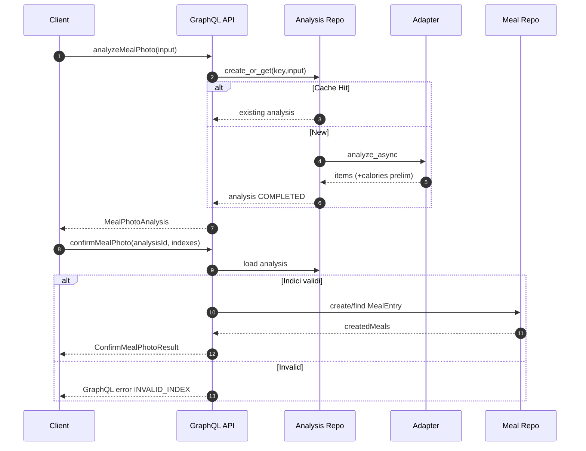
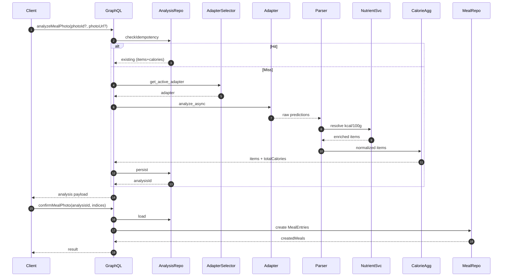

# AI Meal Photo – Evoluzione, Flusso Two‑Step & Calorie

Documenti correlati: 
- [Pipeline AI Food Recognition](ai_food_pipeline_README.md)
- [Prompt GPT-4V Draft](ai_food_recognition_prompt.md)
- [Error Taxonomy](ai_meal_photo_errors.md)
- [Metriche & Fallback](../backend/docs/ai_meal_photo_metrics.md)

## Obiettivo
Ridurre l'attrito nella registrazione dei pasti offrendo un flusso rapido foto → suggerimenti → conferma, partendo da uno stub deterministico (Fase 0) e introducendo gradualmente euristiche, GPT‑4V simulato e futura inference remota.

## Sommario
1. Stato Attuale sintetico
2. Flusso Two‑Step (Analyze → Confirm)
3. Idempotenza
4. Adapter Layer & Selezione
5. Calorie: modello e aggregazione
6. Sequence Diagram (analysis) + Sequence Calorie
7. Errori & Fallback
8. Acceptance Criteria
9. Roadmap & Migrazioni
10. Cross‑link

---
## 1. Stato Attuale (Fase 1 – 2025-09/10)
| Aspetto | Stato | Note |
|---------|-------|------|
| Predictions | Stub + Heuristic + GPT-4V simulato | Flag runtime selezione adapter |
| Idempotenza analyze | Attiva | Chiave esplicita o auto sha256 trunc user|photo refs |
| Conferma | Idempotente per analysisId | Duplicati evitati |
| Calorie item | Calcolate server | Somma coerente totalCalories |
| Metriche | Requests, latency, fallback, errori | Espandibili |
| Error taxonomy | Definita, parziale runtime | Fallback degrade → stub |

---
## 2. Flusso Two‑Step
Vedi anche documento metriche per dettagli di osservabilità.

Step:
1. `analyzeMealPhoto` genera analisi COMPLETED (sempre today) con items proposti.
2. UI mostra items, utente seleziona subset.
3. `confirmMealPhoto` crea `MealEntry` (o riusa se già confermato).

Motivazioni divisione: UX iterativa, future streaming, prevenzione side‑effects se inference lenta/fallisce.

---
## 3. Idempotenza
`analyzeMealPhoto`:
- Usa chiave esplicita oppure genera `auto-<sha256(user|photoId|photoUrl)[:16]>`.
- Ritorno cached non rigenera metriche né tocca adapter.
`confirmMealPhoto`:
- Idempotente per `(analysisId, acceptedIndexes)` → nessuna duplicazione MealEntry.

Migrazione futura: feature flag `AI_IDEMP_HASH_ENABLED` per sostituire progressivamente chiave completa con `photoHash` dedicato.

---
## 4. Adapter Layer
File chiave: `backend/inference/adapter.py`.

Implementazioni attuali:
- Stub: baseline deterministica (2 item)
- Heuristic: modifica quantità / aggiunge acqua
- GPT-4V simulato: prompt + parse JSON + fallback su parse fail

Selezione (priorità): `AI_MEAL_PHOTO_MODE` (gpt4v|heuristic|model|stub) > flag legacy (heuristic/remote) > default stub.

`time_analysis()` avvolge ogni chiamata per metriche di latenza + status.

---
## 5. Calorie: Modello e Aggregazione
Per ogni item: densità kcal/100g risolta con catena di priorità (DB → tabella statica → euristica categoria → fallback 100).
Formula: `calories = round(quantity_g * kcal_100g / 100, 1)` → clamp negativo a 0.
`totalCalories = sum(item.calories)` (o 0 se lista vuota).
Telemetria proposta aggiuntiva: `ai_meal_photo_density_fallback_total` + `ai_meal_photo_calories_compute_seconds`.

Outlier handling: quantità > 2000g clampata a 2000g (flag interno). Unità non‑gram convertite prima con peso medio.

---
## 6. Sequence Diagram (Analyze → Confirm)

### Sequence (Foto → Calorie → LogMeal Dettagliata)

---
## 7. Errori & Fallback
Categorie principali (vedi taxonomy dedicata): timeout, transient, call error, parse error → degradazione verso stub/heuristic con metriche:
- `ai_meal_photo_fallback_total{reason=...}`
- `ai_meal_photo_errors_total{code=PARSE_*}` dove pertinente
Status oggi sempre `COMPLETED` (anche fallback) salvo futuro stato `FAILED`.

Campi diagnostici: `analysisErrors[]`, `failureReason` (futuro), `source`.

---
## 8. Acceptance Criteria
1. Idempotenza stable per analyze.
2. Conferma non duplica MealEntry.
3. Ogni item ha `calories >= 0`.
4. `totalCalories` = somma items.
5. Fallback produce comunque items validi.
6. Metriche: almeno requests + latency + fallback.
7. `source` riflette adapter.
8. Parse error non blocca UX.

---
## 9. Roadmap & Migrazioni
| Step | Descrizione | Stato |
|------|-------------|-------|
| Adapter abstraction | Protocol + stub | DONE |
| Heuristic rules | Quantità variabile + acqua | DONE |
| GPT-4V simulato | Prompt + parse + fallback | DONE |
| Calorie base | Densità + aggregation | DONE |
| Fallback taxonomy estesa | TIMEOUT / TRANSIENT / CALL_ERR | DONE |
| Hash idempotenza dedicato | Flag + migrazione | PLANNED |
| Remote model adapter | Chiamata reale | PLANNED |
| Circuit breaker | Error burst protection | PLANNED |
| Portion refinement | Second pass quantità | PLANNED |
| Nutrient enrichment avanzato | Macro dettagliate | PLANNED |

Migrazione hash: introdurre `photoHash` osservabile → flag → switch definitivo → rimozione chiave legacy.

---
## 10. Cross‑link
- Metriche: `backend/docs/ai_meal_photo_metrics.md`
- Prompt & pipeline: `ai_food_recognition_prompt.md`, `ai_food_pipeline_README.md`
- Errori dettagliati: `ai_meal_photo_errors.md`
- Contratto ingestione: `data_ingestion_contract.md`

---
## Changelog
- v2: Unificazione doc evoluzione + flusso two‑step + calorie (ott 2025)
- v1: Documento iniziale evoluzione (sett 2025)
