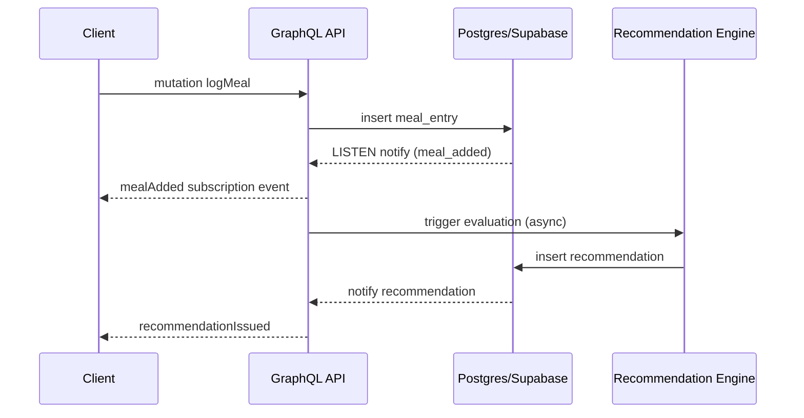

# Backend Platform Architecture & Delivery Plan

Versione: 1.2 (Backend‑Centric + Activity & Recommendation Layer)
Owner: Team Backend
Ultimo aggiornamento: 2025-09-24

## 1. Visione

Costruire un backend GraphQL centralizzato che astrae sorgenti esterne di nutrienti e AI (OpenFoodFacts oggi, Robotoff e pipeline Vision domani) offrendo un contratto stabile ai client (Mobile Flutter + Web Sandbox) con snapshot di nutrienti immutabili al log. La federazione multi‑servizio è rimandata: verrà introdotta solo quando i boundary di dominio divergeranno chiaramente (es. carichi AI intensivi o team separati).

## 2. Principi Architetturali

- Backend‑Centric First: tutta la normalizzazione nutrienti e le chiamate esterne restano lato server.
- Evoluzione Misurata: introdurre caching, metriche e poi (solo se necessario) service decomposition.
- Snapshot Immutabili: ogni `meal_entry` contiene `nutrient_snapshot_json` per eliminare drift da fonti esterne.
- Schema First: aggiunte non breaking versionate; breaking → release semver major backend.
- Idempotenza: `logMeal` supporta chiave esplicita ma usa fallback deterministico se non fornita (più resiliente ad offline retry). Future batch possono richiedere chiave esplicita.
- Osservabilità nativa: trace id propagato in ogni resolver e call esterna.
- Sicurezza difensiva: no secret negli header client, rotate key esterne (OFF/AI) lato backend.

## 3. Bill of Materials (BOM)

| Ambito | Tecnologie | Note |
|--------|------------|------|
| DB Primario | Postgres (Supabase) | RLS + row policies |
| Auth Primario | Auth0 (OIDC) | Token exchange → JWT custom claims |
| Auth Secondario | Supabase Auth (fallback) | Usato per canali realtime se necessario |
| API Layer | FastAPI + Strawberry | Schema GraphQL monolitico (fase iniziale) |
| OFF Adapter | httpx + retry + normalizzazione | Conversioni nutrienti + mapping |
| Caching | In-memory TTL (poi opzionale Redis) | Barcode & product detail |
| AI Pipeline (futuro) | FastAPI internal module | Inference + enrichment |
| Event Bus | Postgres logical decoding / NOTIFY + (futuro) Redpanda/Kafka | Scalare quando volume cresce |
| Cache | Redis (Render) | Session ephemeral, rate limiting |
| Storage Immagini | Supabase Storage Bucket | Policy access controllata |
| CDN | Supabase edge / Cloudflare (futuro) | Distribuzione media |
| Notifications Push | Supabase Edge Functions + FCM/APNs | Orchestrazione iniziale |
| Metrics & Tracing | OpenTelemetry + Prometheus/Grafana (Render) | Dashboard SLO |
| CI/CD | GitHub Actions + Render deploy hooks | Deploy blue/green subservices |
| Infra IaC | Terraform (futuro) | Gestione config prod/staging |

## 4. Milestones Backend (Aggiornate)

Prime fasi mirate a fornire subito la query prodotto (barcode) centralizzata, mutation logging e prime funzioni di consultazione pasti / riepilogo:

| Fase | Focus | Output Chiave | Note |
|------|-------|---------------|------|
| B0 | Scaffold & Health | `hello`, `health`, toolchain preflight | FATTO |
| B1 | Product Query | `product(barcode)` + OFF adapter | FATTO (cache TTL in-memory) |
| B2 | Meal Logging v1 | `logMeal` + snapshot nutrienti | FATTO (in-memory store, enrichment da Product cache, idempotenza base) |
| B2.5 | Meal Listing & Daily | `mealEntries` (filtri after/before/limit) + `dailySummary` (conteggio/calorie base) | FATTO (in-memory aggregate; valori nutrienti avanzati deferred) |
| B2.8 | CRUD Completo Pasti | `updateMeal`, `deleteMeal` + `cacheStats` diagnostiche + nutrient constants | FATTO (ricalcolo automatico nutrienti, repository esteso, metriche cache) |
| B3 | Activity Layer v1 | `ingestActivityEvents` (minute, diagnostica) + `syncHealthTotals` (snapshot) + dailySummary via delta | FATTO |
| B4 | Rolling Baselines & Triggers | `rolling_intake_window` + triggers: sugar, protein, carb/activity | Pianificato |
| B5 | Meal Intelligence | `quality_score`, mealType agg, nuovi trend queries | Pianificato |
| B6 | Realtime & Subscriptions | `mealAdded`, `activityMinuteTick`, `recommendationIssued`, energy balance | Pianificato |
| B7 | Forecast & Reinforcement | Budget cena avanzato, deficit adherence, smoothing net curve | Pianificato |
| B8 | Web Sandbox | Dashboard trend & ring dinamico | Pianificato |
| B9 | Hardening & Scale | Partitioning, metriche avanzate, valutazione decomposizione AI | Pianificato |

### 4.1 Stato Runtime vs Draft (Aggiornato)

Lo schema runtime espone attualmente: `product`, `logMeal`, `updateMeal`, `deleteMeal`, `mealEntries`, `dailySummary` (totali attività da health totals delta), `cacheStats`, `ingestActivityEvents`, `syncHealthTotals`. Le altre query/mutation del draft rimangono deferred.

**Aggiornamenti recenti (v0.4.x):**
1. **CRUD Completo Pasti**: `updateMeal` permette aggiornamento nome/quantità/timestamp/barcode con ricalcolo automatico nutrienti quando cambiano barcode o quantità. `deleteMeal` per rimozione pasti.
2. **Nutrient Constants**: centralizzati in `backend/nutrients.py` (calories, protein, carbs, fat, fiber, sugar, sodium) per consistenza.
3. **Cache Observability**: query `cacheStats` espone keys/hits/misses per diagnostiche performance OpenFoodFacts.
4. **Repository Pattern Esteso**: `InMemoryMealRepository` con `get`, `update`, `delete` oltre ai precedenti `add`/`list`.
5. **AI Meal Photo Stub**: aggiunte mutation `analyzeMealPhoto` / `confirmMealPhoto` con `source=STUB` per preparare boundary pipeline.

Aggiornamenti pianificati (prossime milestone):
1. Evoluzione `dailySummary`: breakdown macro avanzato, target dinamici e gap (B4+).
2. Persistenza Postgres: transizione repository in-memory → storage reale incl. `nutrientSnapshotJson` non nullo.
3. Classificazione semantica schema integrata in CI (script diff AST) per enforcement additive/deprecation/breaking.
4. Deprecazione derivazione implicita chiave idempotenza pasti (richiedere chiave esplicita lato client) – avviso in changelog prima.
5. Timeline attività granulare (`activityTimeline`) basata su minute events con downsampling.
6. Engine raccomandazioni baseline (trigger sugar/protein). 

### 4.2 Convenzione Naming

Strawberry (v0.211.1) applica camelCase automatico ai campi degli input/oggetti. API client devono usare `quantityG` nei payload GraphQL.

## 5. Domain Data Model (Sintesi)

Tabelle principali (Postgres):

- `users` (Auth0 subject mapping)
- `nutrition_plan` (user_id, targets, strategy, updated_at)
- `food_item` (id, name, category, nutrients_json, brand)
- `meal_entry` (id, user_id, occurred_at, meal_type, source, quantity_value, quantity_unit, energy_kcal, protein_g, carb_g, sugars_g, fat_g, sat_fat_g, fiber_g, sodium_mg, micros_json, nutrient_snapshot_json, completeness_score, quality_score, flags[], source_chain, idempotency_key, created_at)
- `daily_intake_summary` (user_id, date, energy_kcal_total, energy_kcal_target, energy_kcal_remaining, predicted_evening_consumption_kcal, macro_split_json, protein_target_g, protein_gap_g, sugar_spike, flags[], generated_at)
- `ai_inference` (id, user_id, raw_label, status, confidence, created_at, items_json)
- `event_log` (id, user_id, type, payload_json, created_at)
 - `notification_log` (id, user_id, rule_id, channel, delivered_at, tapped_at)
 - `activity_event_minute` (user_id, ts, steps, calories_out, hr_avg, hr_min, hr_max, source)
 - `health_totals_delta` (id, user_id, date, timestamp, steps_delta, calories_out_delta, steps_total, calories_out_total, hr_avg_session, idempotency_key, reset, duplicate, conflict)
 - Aggregati: `meal_type_daily_agg`, `rolling_intake_window`, (views) energy balance, pending quality
 - `recommendations` (id, user_id, emitted_at, category, trigger_type, message, payload, status, acknowledged_at)
 - `ai_inference` (id, user_id, stub_items_json, source='STUB', created_at)  # stub attuale (verrà esteso)
### 5.1 Activity Time-Series & Aggregation Layer

Obiettivi:
1. Ingestione minuto (steps, calories_out, heart rate) → query granulari e insight trend.
2. Snapshot cumulativi (`syncHealthTotals`) → derivazione delta affidabili (fonte dailySummary).
3. Aggregazioni incrementali (hourly, daily) per pannelli riepilogo.
4. Downsampling >180 giorni (compressione hourly/daily, drop raw minuti).

Indici: BRIN su `activity_event_minute.ts` + composite `(user_id, ts)`.

### 5.2 Health Totals Delta Layer

Componenti:
| Elemento | Funzione |
|----------|----------|
| Snapshot Store | Registra snapshot cumulativi (steps, caloriesOut, hrAvgSession opzionale) |
| Delta Computation | Calcola differenza vs precedente snapshot o prende valori raw per primo/reset |
| Reset Detection | Se contatori calano: mark reset + delta=nuovi valori |
| Idempotency Guard | Firma (date|steps|caloriesOut|user) o chiave esplicita -> duplicate/conflict |
| Summation API | Fornisce somma delta per `dailySummary` |

Proprietà:
* Idempotente: snapshot identico non genera doppio delta.
* Resiliente: offline gap → invio snapshot successivo ripristina cumulativi corretti (nessuna ricostruzione minute).
* Estensibile: aggiunta future metriche (distanceMeters) senza impattare firma esistente (se escluse).

### 5.3 Rolling Baselines

Tabelle `rolling_intake_window` (7/14d) calcolano medie mobili per comparare andamento corrente (sugar spike, macro pacing). Refresh giornaliero (cron) + caching in-memory TTL 5m.

### 5.4 Meal Intelligence Layer

Estende `meal_entry` con denormalizzazione macro (protein_g, sugars_g...) e campi analitici:
- `completeness_score`: copertura nutrienti base.
- `quality_score` (B5): macro balance, fibra, zuccheri, sat_fat.
- `flags[]`: marcatori euristici (HIGH_SUGAR, LOW_PROTEIN, HEAVY_DINNER...).

Aggregato `meal_type_daily_agg` fornisce macro trend per meal_type → alimenta queries `mealTypeTrends`.

### 5.5 Recommendation Persistence

Tabella `recommendations` append-only, con debounce (unique logico per trigger/day). Worker di delivery aggiorna `delivery_status`. Subscription pubblica nuovi record.

### 5.6 Energy Balance View

Vista (o materialized) `energy_balance_timeslice` calcola cumulativi intake vs burn → curva netta usata per grafico ring dinamico e forecast budget cena.


Indice raccomandati:

- meal_entry: (user_id,date(created_at)) partial index, (user_id, meal_type)
- daily_summary: (user_id,date) unique
- ai_inference: (user_id, created_at desc)

## 6. Federation (Deferrata)

La federazione non è parte delle prime 9 fasi. Criteri di attivazione:

- Throughput AI > 30% CPU totale o latenza p95 > SLO budget
- Team separati con cicli di release indipendenti
- Necessità di isolare failure domain (es. AI outage non deve impattare logMeal)

Quando i criteri saranno soddisfatti: introdurre un secondo servizio (AI) come subgraph, mantenendo core monolitico stabile.

## 7. Sicurezza & Auth Flow

1. Mobile ottiene token Auth0 (OIDC) con audience API.
2. Backend gateway valida firma JWKS Auth0.
3. Claims custom: `sub` → mapping `users` (on first request provisioning lazy).
4. Row Level Security Supabase: policy `user_id = auth.uid()` (se bridging con Supabase Auth richiede exchange server-side per avere session). In alternativa usare Postgres direttamente con connection pooling e claim user_id passato a livello applicativo.
5. Rate limiting API (Redis token bucket) per mutation sensibili (analyzeMealPhoto, logMeal).

## 8. Real-Time Strategy

- Short term: Postgres LISTEN/NOTIFY -> subscription adapter pubblica su websocket gateway.
- Long term: Event bus (Kafka/Redpanda) → aggregator → push incremental.
- Delta payload: `DailyNutritionDelta` riduce banda rispetto full summary.

Estensioni B6:
- `mealAdded` (payload: MealEntry minimal)
- `activityMinuteTick` (batch compress payload)
- `energyBalanceDelta` (timestamp, net_kcal)
- `recommendationIssued` (id, trigger_type, message)



## 9. Notifiche

- Trigger base: Cron Edge Function (Supabase) + query su meal coverage.
- Regole avanzate: microservice rule-engine (Python) legge event_log + proiezioni materializzate.
- Delivery: Push (FCM/APNs) + local scheduling (client) per reminder offline.
- Frequency cap enforced in `notification_log` + unique partial indexes (rule_id + timeframe) eventuali.

## 10. AI Pipeline (Baseline Futuro)

Fase B5 integrerà un modulo interno (non servizio separato) che:

1. Riceve mutation `analyzeMealPhoto` (uploadId)
2. Barcode first pass (se immagine contiene codice) → salta GPT-4V
3. Prompt GPT-4V (vision) → parsing robusto (retry fallback)
4. Matching OFF / dizionario interno
5. Produce record `ai_inference` + ritorna lista candidati
6. `confirmInference` crea `meal_entry` con snapshot nutrienti consolidati

Metriche p95, error ratio e costo per inference tracciati prima di considerare decomposizione.

## 11. Deployment & CI/CD

### GitHub Actions

Workflows attuali nel repository:

- `backend-ci.yml`: pipeline monolitica (preflight → build/test → maintenance → commitlint + schema export).
- `schema-diff.yml`: verifica sincronizzazione mirror schema (classificazione placeholder).
- `mobile-ci.yml`: stub analisi Flutter (attiverà path corretti dopo scaffold mobile/).
- Workflow placeholder vuoti (`backend-preflight.yml`, `backend-changelog.yml`, `backend-github-release.yml`, `backend-schema-status.yml`) che verranno rimossi o popolati con logica reale.

Planned refactor (separazione futura):
1. `backend-lint-test.yml` (PR)
2. `backend-release.yml` (tag push) con changelog + badge aggiornato.
3. `schema-semantic-diff.yml` con classificazione additive/deprecation/breaking.

### Environments

- Staging (feature validation + load light)
- Production (scalare replica DB read se necessario)

Deployment Pattern: Rolling (Render) → canary 10% per ai-service prima del full.

## 12. Observability & SLO

| Servizio | SLO | Misura |
|----------|-----|--------|
| core-nutrition Mutation p95 | <300ms | tracing + histogram |
| analyzeMealPhoto end-to-end p90 | <5s | pipeline metric |
| subscription message latency p95 | <1s | diff produce/consume timestamp |

Alerting (Prometheus rules):

- Error rate logMeal >2% 5m
- AI timeout ratio >10% 15m

## 13. Testing Strategy

| Livello | Strumenti | Focus |
|---------|----------|-------|
| Unit | pytest | matching, portion heuristics, rule engine funcs |
| Integration | pytest + ephemeral DB | mutation + RLS policies |
| Contract | federation composition check | schema invariants |
| Load (mirato) | k6 / locust | logMeal throughput, subscription fanout |
| Security | dependency scan (pip-audit) | CVE critiche |

## 14. Migrazioni Dati

- Alembic (Python) per subgraph tabelle custom.
- Convenzione: versioning cartelle `migrations/versions/` + script auto generate + review manuale.
- Supabase SQL migrazioni separate repository (o gestite via CLI).

## 15. Scalabilità & Performance

- Indici parziali meal_entry riducono bloat.
- Partitioning possibile per meal_entry per mese se >10M row.
- Cache calcoli adherence weekly in materialized view rinfrescata (cron 5m) se carico cresce.

## 16. Risk & Mitigation (Aggiornato)

| Rischio | Mitigazione |
|---------|------------|
| GPT cost escalation | Rate limit + barcode short-circuit |
| Lock contention summary | Incremental update + eventual materialized refresh |
| Subscription overload | Backpressure + message coalescing (aggregate 2s) |
| Federation premature adoption | Posticipata fino a criteri attivazione definiti |

## 17. Web Dashboard (Fase B8)

- Stack: Next.js + Apollo Client + shared GraphQL fragments.
- Auth: Auth0 SPA + silent refresh.
- Funzioni: Filtri avanzati (range date custom), esport CSV, grafici trend (d3/Recharts), admin moderation (future).

## 18. Governance & Versioning

- Version bump schema: semantic (MAJOR.breaking.MINOR additive.PATCH fix).
- Changelog automatico generato da diff script.
- Deprecation policy: 2 release minors di preavviso.

## 19. Logging & Auditing

- Structured logs JSON (correlation_id, user_id, operationName, duration_ms, error_code).
- Audit events: CRUD plan, login mapping, AI inference confirm.
- Retention logs: 30gg raw, 180gg aggregati.

## 20. TODO & Backlog (Aggiornato)

- [x] Product query resolver + tests (B1)
- [x] Mutation logMeal + snapshot + idempotency (B2)
- [x] Meal listing + daily summary base (B2.5)
- [x] CRUD pasti completo (B2.8)
- [x] Health totals sync + delta summary (B3)
- [ ] Cache layer service TTL + SWR (B4)
- [ ] Rolling baselines + triggers core (B4)
- [ ] Timeline attività (`activityTimeline`) + downsampling (B4)
- [ ] Meal intelligence (quality_score, flags) (B5)
- [ ] Trend & insights queries (B5)
- [ ] AI inference baseline (B5)
- [ ] Rate limit analyzeMealPhoto (B5)
- [ ] Realtime subscriptions (B6)
- [ ] Forecast & reinforcement triggers (B7)
- [ ] Metrics & tracing hardening (continuous)
- [ ] RLS policies meal_entry/activity (B4)
- [ ] Materialized view adherence 7d (post B4)

## 21. Appendice: Eventi Principali

| Evento | Descrizione |
|--------|-------------|
| meal_logged | Creazione meal_entry |
| plan_updated | Modifica nutrition_plan |
| ai_inference_confirmed | Inference confermata -> meal_entry |
| daily_summary_recomputed | Rebuild summary giornaliero |
| notification_sent | Notifica emessa |

---

### 22. Deployment Diagram (Monolite Iniziale)

```mermaid
graph LR
  subgraph Clients
    APP[Flutter App]
    SANDBOX[Web Sandbox]
  end

  APP --> API[GraphQL API Monolith]\nFastAPI+Strawberry
  SANDBOX --> API

  API --> OFF[(OpenFoodFacts)]
  API --> GPT[GPT-4V (B5+)]
  API --> DB[(Postgres)]
  API --> CACHE[(In-Memory / Redis)]
```

### 23. Sequence: analyzeMealPhoto (Monolite)

```mermaid
sequenceDiagram
  participant C as Client (Flutter)
  participant G as Gateway
  participant AI as AI Subgraph
  participant OFF as OpenFoodFacts
  participant GPT as GPT-4V
  participant CORE as Core Nutrition

  C->>G: analyzeMealPhoto(uploadId)
  G->>AI: analyzeMealPhoto(uploadId)
  AI->>GPT: Vision prompt (immagine + contesto utente)
  GPT-->>AI: Candidates (label, portion guesses)
  AI->>OFF: Fetch nutrients (per label/barcode) [parallel]
  AI->>CORE: (opt) Lookup internal food items synonyms
  OFF-->>AI: Nutrient data normalized
  CORE-->>AI: FoodItem match (if found)
  AI->>AI: Merge candidates + nutrient grounding + confidence scoring
  AI-->>G: AIInferenceResult (status=PENDING, items[])
  G-->>C: Result (client mostra lista)
  Note over C: Utente conferma selezioni
  C->>G: confirmInference(id,selections[])
  G->>AI: confirmInference(...)
  AI->>CORE: logMeal mutations (batch)
  CORE-->>AI: MealEntry list
  AI-->>G: MealEntry list
  G-->>C: MealEntries + subscription delta
  CORE-->>G: dailyNutritionUpdated (delta) (async)
  G-->>C: Delta ring aggiornato
```

<!-- Diagrammi aggiunti: deployment federation + sequence analyzeMealPhoto -->
