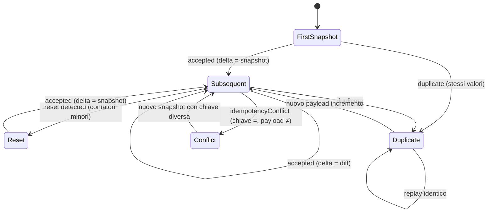

# Health Totals Sync (Activity Snapshot → Delta)

Fonte primaria per i totali attività consumati da `dailySummary` (steps / caloriesOut + HR session opzionale). Questa guida estende il riassunto sintetico presente nel README root.

## Obiettivi

| Obiettivo | Descrizione |
|-----------|-------------|
| Idempotenza robusta | Stesso snapshot (stessi valori chiave) ripetuto non produce nuovi delta. |
| Reset detection | Gestire rollover giorno / reset device (contatori che diminuiscono). |
| Delta derivati | Il `dailySummary` aggrega SOLO i delta, non i raw snapshot. |
| Conflict safety | Due payload diversi con stessa chiave di idempotenza non sovrascrivono lo storico precedente. |
| Evolvibilità | Facilmente estendibile con nuovi campi (es. `distanceMeters`, `activeMinutes`). |

## Glossario

| Termine | Definizione |
|---------|-------------|
| Snapshot | Stato cumulativo dei contatori al momento T per il giorno `date` (scope giornaliero). |
| Delta | Differenza tra questo snapshot e il precedente valido (o lo stesso snapshot se primo / reset). |
| Reset | Rilevato quando `steps` o `caloriesOut` < corrispondente valore precedente → contatori ripartiti. |
| Idempotency Key | Chiave esplicita fornita dal client oppure derivata dai campi payload. |
| Duplicate | Snapshot identico (stessi contatori principali) già registrato → nessun nuovo delta. |
| Conflict | Chiave identica ma payload differente (diversi contatori) → nessun delta + flag conflitto. |

## Schema SDL (Estratto)

```graphql
input HealthTotalsInput {
  timestamp: String!      # ISO8601 istante raccolta snapshot
  date: String!           # Giorno (YYYY-MM-DD) a cui appartiene lo snapshot
  steps: Int!
  caloriesOut: Float!
  hrAvgSession: Float     # opzionale (media HR della sessione associata)
  userId: String          # opzionale (se assente derivato da contesto future auth)
}

type HealthTotalsDelta {
  id: ID!
  userId: String!
  date: String!
  timestamp: String!
  stepsDelta: Int!
  caloriesOutDelta: Float!
  stepsTotal: Int!
  caloriesOutTotal: Float!
  hrAvgSession: Float
}

type SyncHealthTotalsResult {
  accepted: Boolean!
  duplicate: Boolean!
  reset: Boolean!
  idempotencyKeyUsed: String
  idempotencyConflict: Boolean!
  delta: HealthTotalsDelta
}

extend type Mutation {
  syncHealthTotals(input: HealthTotalsInput!, idempotencyKey: String, userId: String): SyncHealthTotalsResult!
}
```

## Flusso Stato (State Machine)



## Algoritmo (Pseudo‑codice)

```python
def sync(snapshot):
    key = snapshot.idempotency_key or derive_key(snapshot)
    existing = repo.get_by_key(key)
    if existing:
        if existing.steps == snapshot.steps and existing.calories_out == snapshot.calories_out:
            return Result(duplicate=True, delta=None)   # niente nuovo delta
        else:
            return Result(idempotencyConflict=True, delta=None)

    prev = repo.last_before(snapshot.date, snapshot.timestamp)
    reset = False
    if prev and (snapshot.steps < prev.steps or snapshot.calories_out < prev.calories_out):
        reset = True
        steps_delta = snapshot.steps
        calories_delta = snapshot.calories_out
    else:
        if not prev:  # primo
            steps_delta = snapshot.steps
            calories_delta = snapshot.calories_out
        else:
            steps_delta = snapshot.steps - prev.steps
            calories_delta = snapshot.calories_out - prev.calories_out

    delta = persist_delta(snapshot, steps_delta, calories_delta, reset)
    persist_snapshot(snapshot, key)
    return Result(accepted=True, reset=reset, delta=delta)
```

## Edge Cases

| Caso | Descrizione | Output |
|------|-------------|--------|
| Primo snapshot giorno | Nessun precedente | `accepted=true`, `delta=valori snapshot` |
| Snapshot identico | Stessi valori steps/caloriesOut | `duplicate=true` |
| Incremento normale | Valori maggiori coerenti | `accepted=true`, `delta=diff` |
| Reset device | Valori inferiori | `accepted=true`, `reset=true`, `delta=valori snapshot` |
| Chiave confliggente | Stessa chiave payload diverso | `idempotencyConflict=true` |

## Idempotenza

Derivazione chiave (fallback):
```
<fisso:"sync"> | <date> | <steps> | <caloriesOut> | <userId>
```
Ragioni per includere i contatori: un retry identico produce stessa chiave → duplicate rapida senza confronto sequenziale.

Consigli client:
1. Inviare snapshot solo quando cambia (debounce locale).
2. Fornire `idempotencyKey` esplicito se si vuole isolare retry a parità di payload anche se i contatori variano localmente (raramente necessario).
3. Loggare `idempotencyKeyUsed` per correlare retry e audit.

## Aggregazione in `dailySummary`

`dailySummary.activitySteps` = somma `stepsDelta` dei delta accettati per `date`.
`dailySummary.activityCaloriesOut` = somma `caloriesOutDelta`.

Minute events (`ingestActivityEvents`) restano SOLO diagnostici, non concorrono ai totali.

## Strategie Client (Mobile)

| Strategia | Motivazione |
|-----------|-------------|
| Debounce 30–60s | Riduce snapshot inutili quasi identici. |
| Persist retry queue | Garantisce invio differito offline. |
| Confronto ultimo snapshot inviato | Evita duplicati locali prima della rete. |
| Gestione reset locale | Se i contatori scendono, inviare subito per ripristinare baseline. |

## Esempi GraphQL

Mutation richiesta:
```graphql
mutation {
  syncHealthTotals(
    input:{
      timestamp:"2025-09-26T10:05:00Z"
      date:"2025-09-26"
      steps: 4200
      caloriesOut: 310.5
      hrAvgSession: 101.2
    }
  ) { accepted duplicate reset idempotencyConflict idempotencyKeyUsed delta { stepsDelta caloriesOutDelta stepsTotal caloriesOutTotal } }
}
```

Risposta incremento normale:
```jsonc
{
  "data": {
    "syncHealthTotals": {
      "accepted": true,
      "duplicate": false,
      "reset": false,
      "idempotencyConflict": false,
      "idempotencyKeyUsed": "sync|2025-09-26|4200|310.5|user-1",
      "delta": {
        "stepsDelta": 800,
        "caloriesOutDelta": 60.5,
        "stepsTotal": 4200,
        "caloriesOutTotal": 310.5
      }
    }
  }
}
```

Risposta duplicate:
```jsonc
{
  "data": {
    "syncHealthTotals": {
      "accepted": false,
      "duplicate": true,
      "reset": false,
      "idempotencyConflict": false,
      "idempotencyKeyUsed": "sync|2025-09-26|4200|310.5|user-1",
      "delta": null
    }
  }
}
```

Conflitto:
```jsonc
{
  "data": {
    "syncHealthTotals": {
      "accepted": false,
      "duplicate": false,
      "reset": false,
      "idempotencyConflict": true,
      "idempotencyKeyUsed": "custom-key-123",
      "delta": null
    }
  }
}
```

Reset:
```jsonc
{
  "data": {
    "syncHealthTotals": {
      "accepted": true,
      "duplicate": false,
      "reset": true,
      "idempotencyConflict": false,
      "idempotencyKeyUsed": "sync|2025-09-26|200|15.0|user-1",
      "delta": {
        "stepsDelta": 200,
        "caloriesOutDelta": 15.0,
        "stepsTotal": 200,
        "caloriesOutTotal": 15.0
      }
    }
  }
}
```

## Evoluzione Futura

| Estensione | Descrizione | Priorità |
|-----------|-------------|----------|
| distanceMeters | Aggiunta campo distanza e relativo delta | Media |
| activeMinutes | Delta minuti attivi leggeri/moderati/intensi | Media |
| session segmentation | Associare snapshot a sessioni workout | Bassa |
| subscription `healthTotalsDelta` | Pubblicazione in tempo reale | Media |
| retention policy | Compattazione delta storici > N giorni | Bassa |

---

Revision: 2025-09-27 · Mantainer: backend core
