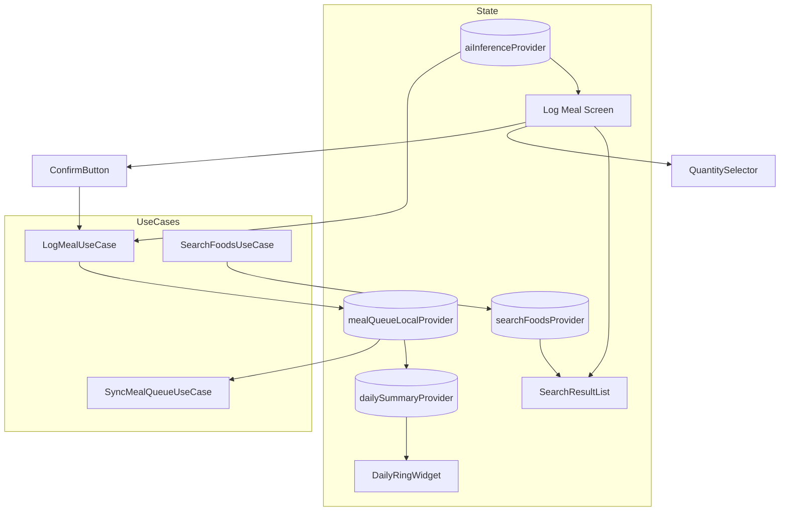
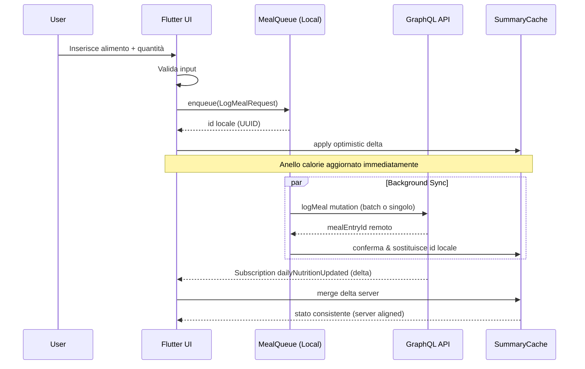

# Mobile Architecture & Delivery Plan

Versione: 1.1 (Allineamento Backend‑Centric)
Owner: Team Mobile
Ultimo aggiornamento: 2025-09-18

## 1. Visione

Fornire una app Flutter cross‑platform (iOS/Android) focalizzata su logging nutrizionale rapido, adattamento dinamico piano e insight storici, delegando ogni integrazione dati esterna al backend GraphQL centralizzato (product lookup, AI, enrichment) per ridurre coupling, migliorare consistenza nutrienti e facilitare rollout evolutivi.

## 2. Principi Architetturali

- Progressive Enhancement: feature avanzate (AI, subscription) solo dopo base stabile.
- Offline-first: logging pasti funziona anche senza rete (queue + sync).
- Clean Architecture: separazione Presentation / Application (use case) / Data / Domain.
- Codegen Driven: GraphQL schema → tipizzazione forte + riduzione boilerplate.
- Observability In-App: eventi prodotto e metriche diagnostiche raccolte in modo consistente.
- Security by Design: token handling isolato, minima esposizione segreti.

## 3. Bill of Materials (BOM)

| Categoria | Strumento / Libreria | Note |
|-----------|----------------------|------|
| Framework | Flutter (stable) | Channel stable + LTS upgrade plan trimestrale |
| Stato | Riverpod | Provider scoping + testabilità |
| Routing | GoRouter | Deep link + web parity futura |
| GraphQL | graphql_flutter + codegen | Contratto stabile; persisted queries fasi successive |
| Serializzazione | Freezed + json_serializable | Immutevolezza modelli |
| Storage offline | Hive / Isar (da valutare) | Cache summary + meal queue |
| Secure Storage | flutter_secure_storage | Refresh token, device keys |
| Auth | Auth0 (OIDC) | Universal links per callback iOS/Android |
| Analytics | Segment (o alternative) | Event pipeline unificata |
| Crash | Sentry | Release health / performance |
| Feature Flags | Remote config (Supabase table / LaunchDarkly opzionale) | Gate rollout |
| Media | image_picker / camera | Foto pasti |
| AI Client | HTTP verso backend (nessuna chiamata OFF diretta) | Upload foto + analyze/confirm |
| Notifications | Firebase Messaging | Wrapper astrazione locale/push |
| CI/CD | GitHub Actions + Codemagic | Build pipeline e distribuzione store |

## 4. Struttura Progetto (Proposta)

```text
lib/
  core/            # error, result, env, logging
  auth/            # auth providers, session
  features/
    nutrition/
      domain/      # entities, value objects
      data/        # repositories impl
      app/         # use cases
      presentation/
        pages/
        widgets/
        controllers/
    ai/
      ...
  graphql/
    fragments/
    queries/
    schema/
  services/        # adapters (food_recognition_service.dart ...)
  storage/         # hive boxes, daos
  l10n/
  theme/
```

## 5. Fasi di Rilascio (Roadmap Mobile)

| Fase | Obiettivo | Scope Tecnico | Uscita |
|------|-----------|---------------|--------|
| M0 | Skeleton App | Routing, Theme, Auth0 login mock | Test interni |
| M1 | MVP Logging Base | Onboarding TDEE, log manuale pasti, daily ring statico | Test amici |
| M2 | Offline Queue | Local meal queue + sync, caching summaries | Beta chiusa |
| M3 | Storico & Weekly View | Serie 7 giorni + macro bars dettagliate | Beta allargata |
| M4 | Notifiche & Reminder | Local + push (colazione, deficit sera) | Store soft launch |
| M5 | AI Foto (Baseline) | analyzeMealPhoto + confirm (backend monolite) | Store v1 |
| M6 | Subscription Real-time | dailyNutritionUpdated + delta UI | v1.1 |
| M7 | Auto-Fill & Heuristics | Confidence policy, autofill safe | v1.2 |
| M8 | Performance & Prefetch | Persisted queries, prefetch range, mem opt | v1.3 |
| M9 | Personalizzazioni UX | Layout configurabile, A/B macro ring | v1.4 |

## 6. Offline & Sync Strategy

- Coda `pending_meals` Hive con stato (pending, syncing, failed).
- Retry esponenziale (1m,5m,15m) fino max 24h.
- Conflict Resolution: se server rifiuta (foodId deprecated) → manual entry fallback; barcode/lookup sempre via `product(barcode)` server.
- Local projection daily summary aggiornata incrementale.

## 7. Error Handling & UX

| Tipo | Pattern |
|------|--------|
| GraphQL Network | Banner temporaneo + retry icona |
| Validation | Inline form errors |
| AI Timeout | Fallback manual logging in <10s |
| Auth Expired | Silent refresh; se fallisce redirect login |

## 8. Sicurezza

- Token OIDC memorizzato in secure storage, access token in memoria volatile.
- PKCE flow obbligatorio.
- Obfuscation codice (proguard/r8) per Android release.
- Device attestation (fase avanzata) per proteggere AI feature premium.

## 9. Testing Strategy

| Livello | Strumenti | Focus |
|---------|-----------|-------|
| Unit | flutter_test + mocktail | Use cases, calcoli TDEE, status ring |
| Widget | golden tests | Dashboard states, macro bars |
| Integration | integration_test | Flusso onboarding → log pasto |
| Contract | schema snapshot | Diff schema GraphQL -> fallimento build |
| Performance | devtools trace | Cold start, frame build dashboard |
| Security | manuale + linters | Token leak, storage review |

## 10. CI/CD

### GitHub Actions

- Lint & Analyze Workflow (push PR): `flutter analyze` + format check + tests
- Schema Drift Check: scarica schema remoto (staging) → diff con locale
- Build Artifacts: generazione build unsigned + upload come artifact

### Codemagic

- Pipeline release: param environment (staging/prod)
- Step: increment build number → run tests → build iOS/Android → notarize (iOS) → upload store / internal track

Release Channels:

- Internal (TestFlight / Closed track)
- Beta
- Production phased rollout (progressivo 10% → 50% → 100%)

## 11. Observability In-App

- Event Wrapper: API unica `track(event, props)` per normalizzare.
- Sessione giornaliera: correlazione meal logs.
- Errori AI: bucket (timeout, parse_error, low_conf).

## 12. Feature Flags

- Tabella `feature_flags` (Supabase) con chiavi: `ai_photo`, `subscription`, `autofill`.
- Cache 5 min + override debug screen.

## 13. Performance Targets

| Metrica | Target |
|---------|--------|
| Cold Start | <2.5s mid-tier device |
| Dashboard first paint | <800ms dopo login |
| AI Foto roundtrip | p90 <5s (MVP) → <3.5s (ottimizzata) (misurato end-to-end client→backend) |
| Rebuild ring log pasto | <16ms frame |

## 14. Risk & Mitigations

| Rischio | Mitigazione |
|---------|------------|
| Latenza AI elevata | Timeout + fallback manuale |
| Consumatori memoria offline | Compaction summaries >120g |
| Deriva schema GraphQL | Snapshot diff pipeline |
| Abuso foto (costi) | Rate limit lato backend + flag user |

## 15. Rollback Strategy

- Feature behind flag → disattiva remoto se crash / regressione.
- Version gating su subscription: fallback polling automatico.

## 16. TODO & Backlog (Estratto)

- [ ] Implementare meal queue offline
- [ ] Golden tests dashboard principali
- [ ] Introduzione persisted queries fase M8
- [ ] Dark mode macro colors contrast AA
- [ ] Rate limit AI foto locale (finestra scorrevole)

## 17. Appendice: Naming Convenzioni

- Providers: suffisso `Provider` (es. `dailySummaryProvider`)
- Use case: verbo + oggetto (`LogMealUseCase`)
- Eventi analytics: snake_case (`meal_logged`)

---

### 18. Diagramma Runtime Riverpod Providers



### 19. Sequence Diagram: Log Pasto (Offline → Sync)



<!-- Fine sezione diagrammi -->
