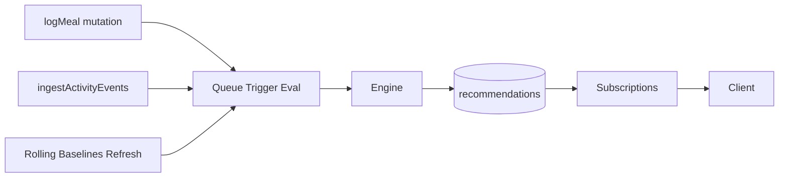
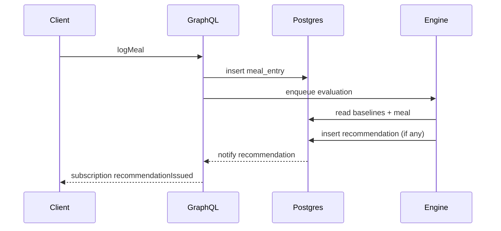

# Recommendation Engine – Dynamic Nutrition & Activity Coaching

Versione: 0.2 (Spec Allineata)
Ultimo aggiornamento: 2025-09-27
Stato Implementazione: NON ancora runtime (nessun trigger emesso). Documento mantenuto aggiornato per preparare l'integrazione.

## 1. Scopo
Fornire micro-raccomandazioni contestuali (nutrizione + attività) basate su deviazioni dal comportamento abituale e dallo stato corrente della giornata, per guidare correzioni rapide e rinforzi positivi.

## 2. Data Flow (Target)

## 3. Trigger Catalog (Draft B4–B7)
| Trigger | Fase | Condizione (Pseudo) | Dipendenze Dati | Azione |
|---------|------|---------------------|-----------------|--------|
| SUGAR_SPIKE | B4 | sugars_today > max(rolling_mean*1.35, 40g) | mealEntries, nutrientSnapshotJson, rolling baselines | Cardio leggero / scelta low-sugar |
| LOW_PROTEIN_PROGRESS | B4 | protein_so_far + 5 < expected_pacing(hour) | Meal log, target protein | Suggerire snack proteico |
| HIGH_CARB_LOW_ACTIVITY | B4 | carb_pct_delta > 0.07 AND caloriesDeficit > 0 | dailySummary (macros parziali) + caloriesDeficit | Attività breve (incrementare expenditure) |
| POST_ACTIVITY_LOW_PROTEIN | B5 | last_hour_calories_out > 150 AND protein_gap > 15 | HealthTotalsDelta + meal log | Prompt recupero proteico |
| EVENING_CALORIE_BUDGET | B5 | caloriesDeficit > 0 AND 17h<=time<=20h | dailySummary.caloriesDeficit | Mostrare budget calorico residuo |
| DEFICIT_ADHERENCE | B7 | replenishedPct in 90..105 | dailySummary.caloriesReplenishedPercent | Rinforzo positivo |

Nuovi campi utilizzati: `dailySummary.caloriesDeficit`, `dailySummary.caloriesReplenishedPercent` (introdotti runtime v0.4.x) consentono logiche deficit/surplus senza ricomputi custom.

## 4. Formule & Dettagli
Pacing proteine (feeding window 16h):
`expected = target_protein_g * (hours_elapsed / 16)`
Spike zuccheri: soglia dinamica descritta nella nutrition guide.
Budget cena: `budget = target_day - energy_so_far - predicted_evening_non_dinner`.

## 5. Debounce & Frequency Cap (Design)
- Un record per trigger/giorno (chiave logica) eccetto LOW_PROTEIN_PROGRESS (slot AM/PM).
- Cooldown configurabile (default 180m per spike zuccheri, 120m proteine, 240m carb/activity).

## 6. Persistence Schema (Sintesi futura)
`recommendations(id, user_id, emitted_at, category, trigger_type, message, payload jsonb, delivery_status, acknowledged_at)`.
Indice `(user_id, emitted_at desc)`.

## 7. Config Defaults & Override (Proposed)
| Parametro | Default | Note |
|-----------|---------|------|
| sugar_spike.factor_baseline | 1.35 | moltiplicatore media rolling |
| sugar_spike.min_abs_early_g | 40 | soglia minimo assoluta |
| protein_pacing.slack_g | 5 | tolleranza iniziale |
| carb_activity.carb_pct_delta | 0.07 | delta % assoluto |
| carb_activity.calories_out_delta | 60 | deficit vs rolling |
| post_activity.cal_out_threshold | 150 | kcal ultima ora |
| post_activity.protein_gap_min_g | 15 | gap proteine |
| evening_budget.min_positive_ratio | 0.15 | % target per messaggio positivo |

Override futuro: tabella `user_trigger_overrides`.

## 8. Metrics & Monitoring (Planned)
| Metrica | Descrizione |
|---------|-------------|
| recommendations_emitted_total | Counter per trigger |
| recommendation_suppressed_total | Debounce/frequency cap |
| trigger_eval_latency_ms | Tempo valutazione batch |
| sugar_spike_false_positive_rate | Campionamento feedback utente |

## 9. Estensioni Future
- Fiber & Sodium heuristics
- Hydration tracking
- ML pacing adattivo (EWMA / regression)
- Multi-trigger message bundling

## 10. Sequence Diagram (Meal Trigger Draft)

## 11. Testing Strategy (Pre-runtime)
- Unit: funzioni condizione (boundary tests).
- Integration: simulazione giornata sintetica (dataset scenario).
- Load: stress 50 raccomandazioni/min per debouncing.

## 12. Open Questions (Aggiornate)
- Aggiungere feedback loop utente (thumb up/down) prima di ML?
- Smoothing differenziato per proteine rispetto carbo?
