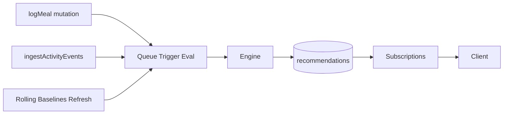
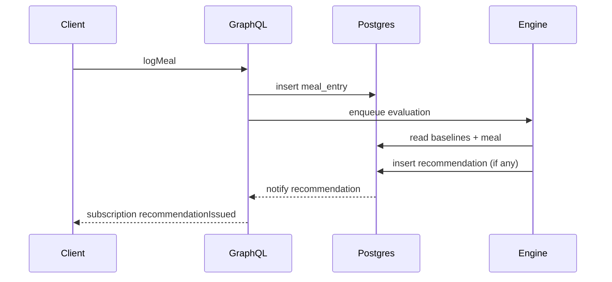

# Recommendation Engine – Dynamic Nutrition & Activity Coaching

Versione: 0.1
Ultimo aggiornamento: 2025-09-20

## 1. Scopo
Fornire micro-raccomandazioni contestuali (nutrizione + attività) basate su deviazioni dal comportamento abituale e dallo stato corrente della giornata, per guidare correzioni rapide e rinforzi positivi.

## 2. Data Flow

## 3. Trigger Catalog (MVP Fasi B4–B7)
| Trigger | Fase | Condizione Sintetica | Azione |
|---------|------|----------------------|--------|
| SUGAR_SPIKE | B4 | sugars_so_far > max(rolling_mean*1.35,40g) | Suggerire cardio leggero / bilanciamento |
| LOW_PROTEIN_PROGRESS | B4 | protein_so_far +5 < expected_pacing | Snack proteico |
| HIGH_CARB_LOW_ACTIVITY | B4 | carb_pct_delta>0.07 & activity_deficit | Attività breve |
| POST_ACTIVITY_LOW_PROTEIN | B5 | last_hour_calories_out>150 & protein_gap>15 | Recupero proteico |
| EVENING_CALORIE_BUDGET | B5 | energy_kcal_remaining>0 & 17–20h | Budget cena numerico |
| DEFICIT_ADHERENCE | B7 | aderenza giorno ∈ [90%,105%] | Rinforzo positivo |

## 4. Formule & Dettagli
Pacing proteine (feeding window 16h):
`expected = target_protein_g * (hours_elapsed / 16)`
Spike zuccheri: soglia dinamica descritta nella nutrition guide.
Budget cena: `budget = target_day - energy_so_far - predicted_evening_non_dinner`.

## 5. Debounce & Frequency Cap
- Un record per trigger/giorno (chiave logica) eccetto LOW_PROTEIN_PROGRESS (slot AM/PM).
- Cooldown configurabile (default 180m per spike zuccheri, 120m proteine, 240m carb/activity).

## 6. Persistence Schema (Sintesi)
`recommendations(id, user_id, emitted_at, category, trigger_type, message, payload jsonb, delivery_status, acknowledged_at)`.
Indice `(user_id, emitted_at desc)`.

## 7. Config Defaults & Override
| Parametro | Default | Note |
|-----------|---------|------|
| sugar_spike.factor_baseline | 1.35 | moltiplicatore media rolling |
| sugar_spike.min_abs_early_g | 40 | soglia minimo assoluta |
| protein_pacing.slack_g | 5 | tolleranza iniziale |
| carb_activity.carb_pct_delta | 0.07 | delta % assoluto |
| carb_activity.calories_out_delta | 60 | deficit vs rolling |
| post_activity.cal_out_threshold | 150 | kcal ultima ora |
| post_activity.protein_gap_min_g | 15 | gap proteine |
| evening_budget.min_positive_ratio | 0.15 | % target per messaggio positivo |

Override futuro: tabella `user_trigger_overrides`.

## 8. Metrics & Monitoring
| Metrica | Descrizione |
|---------|-------------|
| recommendations_emitted_total | Counter per trigger |
| recommendation_suppressed_total | Debounce/frequency cap |
| trigger_eval_latency_ms | Tempo valutazione batch |
| sugar_spike_false_positive_rate | Campionamento feedback utente |

## 9. Estensioni Future
- Fiber & Sodium heuristics
- Hydration tracking
- ML pacing adattivo (EWMA / regression)
- Multi-trigger message bundling

## 10. Sequence Diagram (Meal Trigger)

## 11. Testing Strategy
- Unit: funzioni condizione (boundary tests).
- Integration: simulazione giornata sintetica (dataset scenario).
- Load: stress 50 raccomandazioni/min per debouncing.

## 12. Open Questions
- Aggiungere feedback loop utente (thumb up/down) prima di ML?
- Smoothing differenziato per proteine rispetto carbo?
