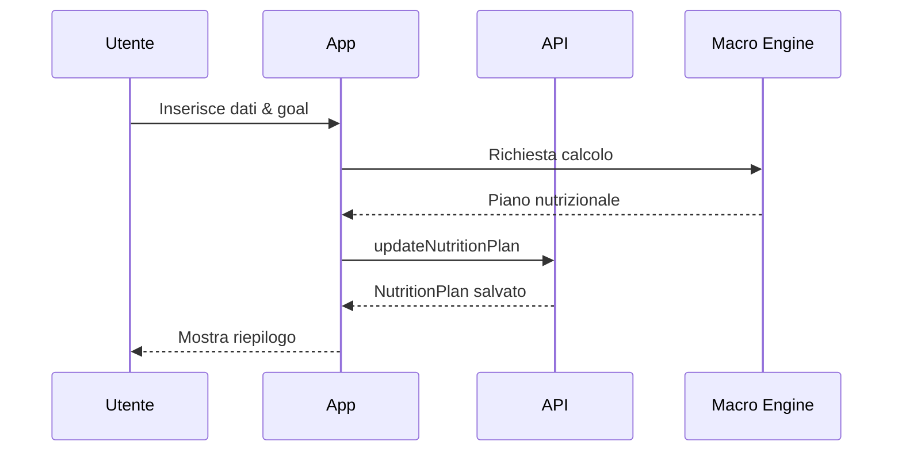
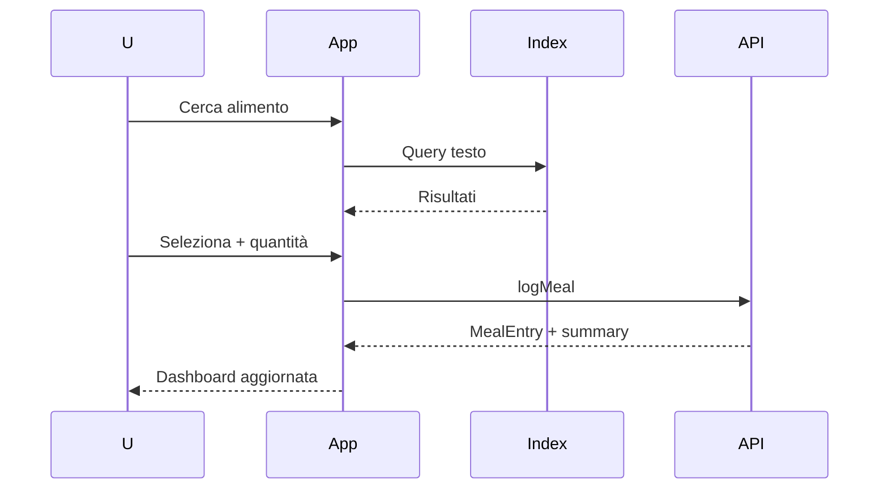
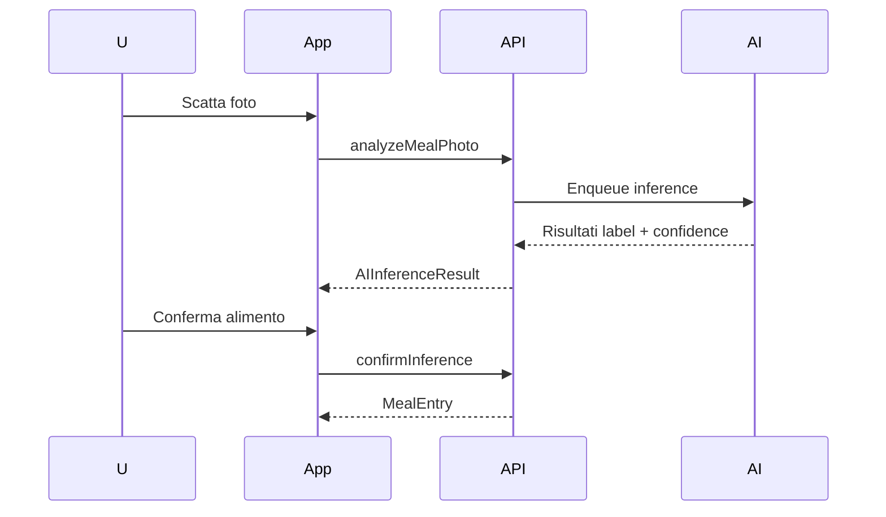
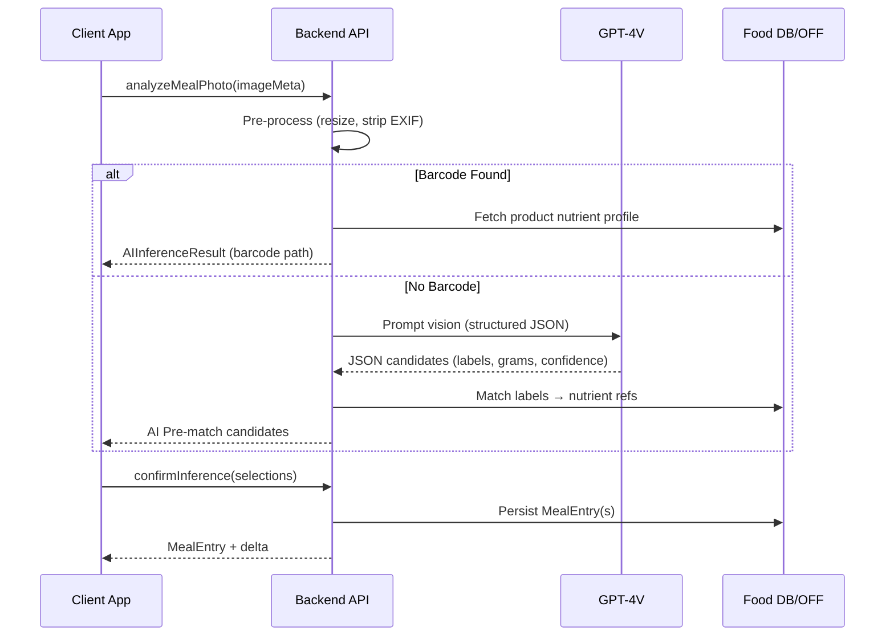

> Questo documento è stato spostato in `docs/nutrifit_nutrition_guide.md`. Manteniamo uno stub per retro‑compatibilità. Aggiorna eventuali bookmark.

# Nutrifit – Nutrition & Diet Engine Guide (Moved)

## 1. Vision & Scopo
Obiettivo: integrare tracking nutrizionale intelligente (calorie + macronutrienti + aderenza al piano) con i dati di spesa energetica provenienti da HealthKit / Google Fit per fornire all’utente un quadro completo: deficit / mantenimento / surplus e progressi verso il goal.

Valore chiave:
- Unico pannello integrato input (cibo) + output (dispendio) + goal adattivi.
- Supporto logging multi-canale: ricerca alimenti, barcode, foto + AI, inserimento rapido porzioni/ricette.

Consultare il contenuto completo aggiornato in `docs/nutrifit_nutrition_guide.md`.
- Possibile estensione futura: UserCustomFoodItem (privacy separata)
- Normalizzazione label AI → sinonimi (thesaurus)
- Portion suggestions per ridurre attrito logging

## 5. Calcoli & Formule (Estesi)
### 5.1 BMR (Mifflin-St Jeor)
Uomo: `10 * kg + 6.25 * cm - 5 * età + 5`  | Donna: `10 * kg + 6.25 * cm - 5 * età - 161`

### 5.2 Alternative (Katch-McArdle se %BF nota)
`BMR = 370 + 21.6 * LBM_kg`  con LBM da Boer:
Uomo: `0.407*peso + 0.267*altezza_cm - 19.2` | Donna: `0.252*peso + 0.473*altezza_cm - 48.3`

### 5.3 Activity Factor
Sedent 1.2 · Light 1.375 · Moderate 1.55 · High 1.725 · Athlete 1.9
`TDEE = BMR * activityFactor`

### 5.4 Strategia Goal
Cut: `TDEE * (1 - deficit%)` (10–20%) | Bulk: `TDEE * (1 + surplus%)` (5–15%) | Maintain: `≈ TDEE`

### 5.5 Macro Allocation Baseline
1. Proteine: 1.6–2.2 g/kg (range alto in cut)
2. Grassi: 0.6–1.0 g/kg (mai <0.5)
3. Carbo: kcal restanti /4

### 5.6 Arrotondamenti
- Macro arrotondati a multipli di 5g
- Ricalibra carbo se scostamento kcal >2%

### 5.7 Aderenza
Calorie: `consumate / target` (clamp 0–2)
MacroAdherence: `1 - avg(|consumo-target|/target)`

### 5.8 Recalibrazione Peso / Piano
Trigger se scostamento trend peso vs atteso persiste ≥7 giorni e aderenza >80%.

### 5.9 Adattamento Dinamico Macro
Priorità modifica: Carbo → Grassi → Proteine (proteine stabili per mantenere massa).

### 5.10 Edge
- Obesità severa: proteine su LBM
- Endurance: carbo min 4 g/kg
- Cheto: fuori scope MVP

### 5.11 TODO
- Fiber & satiety score
- NEAT adattivo
- Water intake formula

## 6. GraphQL Schema (Nutrition – Bozza Concettuale)
```graphql
# Estensioni schema esistente

type NutritionPlan {
  targetCalories: Int!
  proteinTarget: Int!
  carbsTarget: Int!
  fatTarget: Int!
  strategy: GoalStrategy!
  updatedAt: DateTime!
}

type Nutrients {
  calories: Int!
  protein: Float!
  carbs: Float!
  fat: Float!
  fiber: Float
  sugar: Float
  sodium: Float
}

type FoodItem {
  id: ID!
  name: String!
  brand: String
  category: String
  nutrients: Nutrients!
  portionSuggestions: [Portion!]!
}

type Portion {
  label: String!
  grams: Float!
}

type MealEntry {
  id: ID!
  mealType: MealType!
  food: FoodItem!
  quantity: Float!      # in grams o unità base normalizzata
  unit: String!         # g | ml | unit
  nutrients: Nutrients! # calcolati = food.nutrients * (quantity/100)
  createdAt: DateTime!
}

type DailyNutritionSummary {
  date: Date!
  total: Nutrients!
  adherenceCalories: Float!
  remainingCalories: Int!
  macroAdherence: Float!
  mealCount: Int!
}

type AIInferenceResult {
  id: ID!
  rawLabel: String!
  confidence: Float!
  normalizedFood: FoodItem
  status: InferenceStatus!
}

enum MealType { BREAKFAST LUNCH DINNER SNACK }
enum GoalStrategy { CUT MAINTAIN BULK }
enum InferenceStatus { PENDING MATCHED REJECTED CONFIRMED }

extend type Query {
  myNutritionPlan: NutritionPlan
  dailyNutrition(date: Date!): DailyNutritionSummary
  meals(date: Date!): [MealEntry!]!
  searchFoods(query: String!, limit: Int = 20): [FoodItem!]!
  aiInference(id: ID!): AIInferenceResult
}

input LogMealInput {
  mealType: MealType!
  foodId: ID!
  quantity: Float!
  unit: String!
}

input UpdateNutritionPlanInput {
  strategy: GoalStrategy
  targetCalories: Int
  proteinTarget: Int
  carbsTarget: Int
  fatTarget: Int
}

extend type Mutation {
  logMeal(input: LogMealInput!): MealEntry!
  updateNutritionPlan(input: UpdateNutritionPlanInput!): NutritionPlan!
  analyzeMealPhoto(uploadId: ID!): AIInferenceResult!
  confirmInference(id: ID!, foodId: ID!, quantity: Float!, unit: String!): MealEntry!
}
```
TODO: Definire campi di paginazione, filtri alimenti (categoria, macro range), error codes.

> NOTE: Lo schema definitivo modulare è ora in `lib/graphql/schema_nutrition.graphql` con fragments in `lib/graphql/fragments/nutrition_fragments.graphql` e operazioni in `lib/graphql/queries/nutrition/nutrition_queries.graphql`. Vedi `lib/graphql/nutrition_README.md` per integrazione codegen.

## 7. Flussi Principali (Sequenza – Descrittivo)
1. Onboarding nutrizionale:
  - Utente inserisce dati fisici → calcolo TDEE → generazione piano → salvataggio NutritionPlan
2. Log pasto manuale:
  - Query ricerca → selezione FoodItem → input quantità → mutation logMeal → aggiorna summary cache
3. Foto piatto:
  - Upload → Mutation analyzeMealPhoto → polling/Subscription stato → conferma utente → crea MealEntry
4. Barcode:
  - Scan → chiamata backend → se non presente fetch esterno → normalizza → ritorna FoodItem → logMeal
5. Adattamento piano (batch giornaliero o su richiesta):
  - Calcola trend 7 giorni → se deviazione > soglia → suggerisci nuovo target

### 7.1 Sequence Diagram Onboarding


### 7.2 Sequence Diagram Log Pasto


### 7.3 Sequence Diagram Foto AI


### 7.4 Error & Retry (Sintesi)
- AI timeout >12s → fallback manuale
- Barcode miss → wizard alimento custom
- logMeal rete: retry esponenziale (max 3)

## 8. Struttura Flutter (Estensioni)
```
lib/
  presentation/
    screens/nutrition/
      meal_log_screen.dart
      nutrition_dashboard_screen.dart
      food_search_screen.dart
      ai_inference_screen.dart
    providers/nutrition/
      nutrition_plan_provider.dart
      daily_nutrition_provider.dart
      food_search_provider.dart
      ai_inference_provider.dart
  data/
    models/nutrition/
      food_item.dart
      nutrients.dart
      meal_entry.dart
      nutrition_plan.dart
    repositories/
      nutrition_repository_impl.dart
    datasources/remote/nutrition_remote_datasource.dart
    datasources/local/nutrition_local_datasource.dart
  domain/
    entities/nutrition/... (mirror models puri)
    repositories/nutrition_repository.dart
    usecases/nutrition/
      log_meal_usecase.dart
      get_daily_summary_usecase.dart
      update_plan_usecase.dart
```
TODO: Specificare mapping entity-model + error handling standard.

## 9. Mocking & Dev Senza Backend
Tecniche:
- MockLink per Query/Mutation (fixture JSON → mapping → delay). 
- Dataset base: `assets/mocks/foods.json`, `assets/mocks/daily_summary_example.json`.
- Generatore casuale pasti per giornate passate.
- Flag `USE_FAKE_NUTRITION_BACKEND=true` per switchare repository.
- Simulazione AI: restituisce 2–3 candidate con confidence e 1 null.

TODO: Elenco completo fixtures + script generazione.

## 10. Metriche & Telemetria
Metriche applicative:
- meal_log_success_total
- ai_inference_latency_ms (p95)
- nutrition_plan_adjustments_total
- calorie_adherence_distribution
- photo_to_confirmed_ratio

Eventi prodotto:
- meal_logged
- plan_updated
- ai_inference_confirmed / rejected
- adhoc_goal_adjustment_suggested / accepted

TODO: Definire schema eventi (proprietà obbligatorie, naming convention).

### 10.1 Event Naming & Payload
Formato: `scope_action` (snake_case) es: `meal_logged`, `plan_adjustment_suggested`.
```json
{
  "event": "meal_logged",
  "ts": "2025-09-18T10:21:00Z",
  "user_id": "u123",
  "meal_type": "LUNCH",
  "calories": 620,
  "protein_g": 38,
  "carbs_g": 55,
  "fat_g": 22,
  "adherence_calories_pct": 0.54,
  "day_meal_count": 3
}
```
Obbligatori: event, ts, user_id, platform, session_id (se disponibile).

### 10.2 Derived Metrics
- adherence_trend_7d
- macro_deviation_protein_pct

### 10.3 Anti-Pattern
- Evitare payload troppo grandi ripetitivi (no nutrient profile completo ad ogni evento).
- Evitare chiavi dinamiche.

## 11. Sicurezza & Privacy
Punti chiave:
- Minimizzazione: non memorizzare immagini dopo conferma (solo hash opzionale)
- Health data + Nutrition separare namespace tabelle
- Consensi granulari (toggle per AI foto, uso dati per insight avanzati)
- Data retention: meal details > 24 mesi → aggregati
- Certificate pinning lato app (fase successiva)

TODO: Aggiungere DPIA outline + lista PII + classificazione.

## 12. Testing Strategy (Nutrition Scope)
Livelli:
- Unit: calcolo macro distribuzione, TDEE, adattamento target.
- Repository: mock GraphQL + validazione mapping.
- Widget: meal log form (validazioni quantità / unit). 
- Integration: flusso log pasto + aggiornamento dashboard.
- Contract: snapshot schema GraphQL (breaking change detection).

TODO: Definire matrice test edge (zero meals, over target 200%, macro sbilanciati).

## 13. Performance & Caching
- Cache FoodItem locale (index per name lowercase + trigram scoring semplice)
- LRU 500 elementi recenti
- TTL barcode 7 giorni
- Pre-fetch top 50 alimenti più usati
- Aggiornamento summary incrementale (aggiungi nutrienti entry → evita full recompute)

TODO: Calcolare soglie memoria e strategia eviction multi-livello.

## 14. Roadmap (Estratto)
| Sprint | Obiettivo | Output |
|--------|-----------|--------|
| S1 | Onboarding + TDEE + log pasto base | NutritionPlan + logMeal mutation |
| S2 | Dashboard nutrizionale + daily summary | DailyNutritionSummary query |
| S3 | Barcode + caching | barcode resolver + UI scan |
| S4 | AI foto (mock) + conferma | analyzeMealPhoto + confirmInference |
| S5 | Trend settimanali + suggerimenti piano | Adherence engine |
| S6 | Notifiche + adattamento automatico | Plan adjustment use case |

## 15. Open Questions
- Porzioni: normalizzare densità liquidi? (ml→g) fonte database?
- Multi-goal (ricomposizione: perdere grasso + mantenere peso?) supporto?
- Gestione alimenti custom utente (privacy scope?)
- Uso water tracking integrato? (estendere Nutrients?)

## 16. Edge Cases & Validation Rules
| Categoria | Caso | Regola | Azione |
|-----------|------|--------|--------|
| Quantità | 0 o negativa | quantity > 0 | Errore form |
| Macro | Proteine <0.8 g/kg (cut) | Warning | Suggerisci aumento |
| Macro | Grassi <0.5 g/kg | Hard stop | Blocca piano |
| Calorie | Deficit >25% >21g | Flag rischio | Mostra avviso |
| Foto AI | Confidence <0.4 | Non auto-match | Richiedi selezione |
| Barcode | Ripetuti miss | >=2 | Offri alimento custom |
| Adattamento | Troppi cambi | >1 ogni 7g | Posticipa |
| TDEE | TDEE < BMR*1.1 | Activity errata | Chiedi conferma |

## 17. AI Pipeline (Dettagli)
Stati: CLIENT_CAPTURED → UPLOADED → QUEUED → PROCESSING → (MATCHED | REJECTED) → (CONFIRMED | MANUAL_ENTRY)

SLA: timeout 12s (UI fallback a 8s). Immagine eliminata <60s post inference salvo consenso training.

Error Codes principali:
- AI_MODEL_UNAVAILABLE (retry)
- LOW_CONFIDENCE (manual confirm)
- IMAGE_TOO_DARK (retake)
- NORMALIZATION_FAILED (search manual)

## 18. Plan Adaptation Use Case (Sintesi)
Pseudocodice:
```pseudo
if adherence > 0.8 and |trend_weight - expected| > threshold and days_since_last_adjust >= 7:
   delta_pct = clamp((trend_weight - expected)/|expected|, -0.15, 0.15)
   new_cal = round_to_50(old_cal * (1 - delta_pct))
   adjust carbs first; if carbs < minCarb then reduce fats; proteins last.
```
Safeguard: non prima di 10 giorni dall'onboarding.

## 19. GraphQL Pagination & Connections (Definitivo)
```graphql
type PageInfo { hasNextPage: Boolean!, hasPreviousPage: Boolean!, startCursor: String, endCursor: String }
type FoodItemEdge { cursor: String!, node: FoodItem! }
type FoodItemConnection { edges: [FoodItemEdge!]!, pageInfo: PageInfo!, totalCount: Int }
extend type Query {
  searchFoodsConnection(query: String!, first: Int, after: String, category: String): FoodItemConnection!
}
```
Note: totalCount calcolato lazy per performance.

## 20. DPIA & Data Classification (Bozza)
| Categoria | Esempi | Sensibilità | Base Legale |
|-----------|--------|-------------|-------------|
| Identificativi | email, userId | Medio | Contratto |
| Dati fisici | peso, altezza | Alto | Consenso |
| Dati salute indiretti | calorie, macro | Alto | Consenso |
| Immagini pasti | foto | Alto | Consenso separato |

Misure: Encryption at rest, separazione PII, retention policy, audit accessi.

Checklist:
- [ ] Consensi granulari
- [ ] Registro trattamenti
- [ ] Procedure data subject request
- [ ] Retention implementata
- [ ] Audit log attivo

## 21. Glossario (Aggiornato)
- BMR: Basal Metabolic Rate
- TDEE: Total Daily Energy Expenditure
- Adherence: Rapporto consumi/target
- Macro Split: Distribuzione % kcal P/C/F
- LBM: Lean Body Mass
- NEAT: Non-Exercise Activity Thermogenesis
- Confidence (AI): probabilità stimata modello

---
Sezione revisione iterativa: inserire commenti inline con `> NOTE:` durante le prossime revisioni.

## 22. Dashboard & Home UX (Nuova)
Obiettivo: Massimizzare frequenza e qualità del logging pasti riducendo frizione cognitiva e mostrando in modo CHIARO lo stato calorico della giornata e il trend multi-range.

### 22.1 Gerarchia Visiva (Priorità)
1. Stato Calorico Giornaliero (consumato / target + delta) → decisione immediata: posso aggiungere? devo moderare?
2. Macro Progress (stack / individual bars) → feedback qualitativo (proteine sufficienti? grassi eccessivi?)
3. Time Range Switch (Day / Week / Month / Year) → contesto trend e consistenza.
4. CTA "Aggiungi Pasto / Alimento" sempre raggiungibile (FAB + scorciatoia seconda posizione nav).
5. Lista ultimi 3 pasti (scroll espandibile) + Quick Actions (ripeti, duplica, foto, barcode).

### 22.2 Visualizzazione Stato Calorico Giornaliero
Componente primario: CalorieBalanceRing
- Centro: numero principale kcal consumate (grande)
- Sub-line: `di <target>` + delta (`+120` o `-340` kcal) con colore semantico
- Anello: porzione riempita = min(consumed/target, 1). Se >100% mostra overlay extra (bordo pulsante / wedge esterno).
- Macro overlay (opzione): linee sottili segmentate interne (P/C/F) proporzionali alle kcal macro.

Stati semantici (status):
| Stato | Condizione | Colore Primario | Feedback Testuale |
|-------|------------|-----------------|-------------------|
| NORMAL | 0.0–0.89 target | brandPrimary | "In linea" |
| HIGH_WARNING | 0.9–1.04 | amber | "Quasi al target" |
| OVER | 1.05–1.20 | orange | "Oltre il target" |
| EXCESS | >1.20 | red | "Eccesso significativo" |
| LARGE_DEFICIT | <0.60 (dopo le 18:00) | blueAccent | "Deficit elevato" |

Colori accessibili (WCAG AA contrast > 4.5:1 con sfondo). Prevedere pattern secondario (hatching) per OVER/EXCESS per utenti con daltonismo.

### 22.3 Macro Progress Bars
Layout orizzontale 3 barre (Proteine, Carbo, Grassi) con:
- Fill percentuale = consumato/target macro
- Badge testuale: `80g / 130g` + `%`
- Colori neutri + highlight Proteine (accent) per enfatizzare sufficienza proteica.
- Stato OVER macro >110% target → bordo pulsante + label rossa ridotta (non invasiva).

### 22.4 Time Range Switch (Daily / Weekly / Monthly / Annual)
Componente: TimeRangeSelector (segmented control) + Secondary filter (calendar picker on long-press / overflow menu).

Aggregazioni:
- Day: dati da `dailyNutritionSummary(date)` (già definito). Real-time incremental update post log.
- Week: finestra scorrevole 7 giorni (non settimana ISO rigida) default = ultimi 7 completi inclusa oggi.
  - Metriche: avg_kcal, adherence_pct_avg, protein_avg_g, variance_calories (std dev), sparkline (adherence per giorno).
- Month: aggregazione per giorno → mediana kcal, adherence distribution (box plot ridotta), macro ratio medio vs target.
- Year: 12 bucket mensili → average kcal, adherence consistency score (# giorni con log >=2 pasti / giorni nel mese), weight trend overlay (se disponibile) in linea sottile.

Backend Gap: attualmente schema non ha range aggregator. Proposta estensione:
```graphql
extend type Query {
  nutritionSummaryRange(start: Date!, end: Date!): [DailyNutritionSummary!]!
}
```
Client Strategy (fase 1 senza estensione): parallel fetch giorni (max 7) con batching e caching LRU; deduplicare richieste già in memoria.

Caching/Prefetch: quando utente apre Day → prefetch ultimi 6 giorni in background (priorità bassa) per transizione rapida a Week.

### 22.5 CTA "Aggiungi" (Food / Meal)
Pattern consigliato: FloatingActionButton esteso (etichetta "Log Pasto" + icona fork/knife) ancorato sopra navigation bar.
Azioni secondarie (Speed Dial oppure Bottom Sheet):
- Cerca Alimento
- Scan Barcode
- Foto Piatto (AI)
- Pasto Veloce (template last used)

Focus order tastiera (accessibilità): FAB → ring → time range → macro bars → recent meals.

### 22.6 Real-Time Update Strategy
1. Utente logga pasto → Optimistic update: aumentare consumedKcal & macro locali prima risposta server.
2. In caso errore mutation → rollback valori + toast.
3. Invalidazione providers: `dailySummaryProvider(date)` + `weeklyAggregateProvider` (solo se week range include date).
4. Eventi: dispatch `meal_logged` con flag `optimistic=true` se prima della conferma server.
5. Auto-refresh: timer minuto per aggiornare countdown fine giornata (UI label "Manca Xh") se mostrata.

### 22.7 Component Contracts (Pseudocode)
```dart
class CalorieBalanceRing extends StatelessWidget {
  final int consumedKcal; // >=0
  final int targetKcal;   // >0
  final int deltaKcal;    // consumed - target
  final CalorieStatus status; // enum
  final double progress;  // consumed/target (clamped)
  final MacroBreakdown? macro; // optional for segmented ring
}

class TimeRangeSelector extends StatelessWidget {
  final TimeRange range; // day|week|month|year
  final ValueChanged<TimeRange> onChanged;
}

class MacroBars extends StatelessWidget {
  final MacroBreakdown breakdown; // consumed & target per macro
}

class QuickAddFab extends StatelessWidget {
  final VoidCallback onAddFood;
  final VoidCallback onScan;
  final VoidCallback onPhoto;
  final VoidCallback onTemplate;
}
```
Provider derivati:
- `calorieStatusProvider` → calcola enum status in base a ratio + orario corrente (per LARGE_DEFICIT logica temporale)
- `weeklyAggregateProvider` → memoizza array 7 summaries.

### 22.8 Skeleton & Loading States
- Anello placeholder con shimmer + testo grigio per 300–600ms (evitare flash layout se risposta <100ms).
- Macro bars: barre vuote con shimmer.
- Week/Month: placeholder sparkline lines.

Timeout Fallback: se daily summary >1.5s → mostra banner: "Connessione lenta – valori in aggiornamento" + tentativo retry.

### 22.9 Edge / Error Cases
| Caso | Gestione |
|------|----------|
| targetKcal = 0 | fallback label "Configura Piano" + CTA onboarding |
| Primo giorno senza pasti | Stato empty con illustrazione + CTA centrale "Logga il primo pasto" |
| Over >150% | Ring pulsante (animazione breve 800ms) poi stato statico; testo warning educato |
| Negative delta (grande deficit) a tarda sera | Suggerimento snack proteico opzionale |
| Timezone change (viaggio) | Recalcolo summaries usando offset locale; marcare giorno con icona relocation |
| Offline log | Queue locale; UI label "Sincronizzazione in attesa" su ring (badge) |

### 22.10 Accessibilità
- Contrast: testo principale kcal ≥ 7:1.
- VoiceOver: annunciare: "Calorie consumate 1350 di 2000, mancano 650, stato in linea".
- Gestures alternative: long-press ring → mostra breakdown macro popup.
- Hit area FAB ≥ 56px; segmenti time range ≥ 44px.

### 22.11 Performance Considerations
- Avoid rebuild global: separare ring, macro, recentMeals in ConsumerWidget distinti.
- Debounce aggiornamenti weekly aggregate (150ms) se multiple meal logs ravvicinati.
- Lazy list recent meals (cache extent ridotto).
- Pre-calc progress & status nel layer use case per ridurre logica in build().

### 22.12 Analytics & Telemetria (Estensioni)
Nuovi eventi:
- `dashboard_range_changed` { from, to, duration_view_ms }
- `quick_add_opened` { method: barcode|photo|search|template }
- `meal_logged_from_home` (flag origin=home_ring | home_fab | recent_meal_repeat)
- `macro_longpress_breakdown` {}

Metriche derivate:
- dashboard_daily_open_rate
- avg_time_to_log_after_open (ms)
- ring_over_target_rate (rolling 30d)

### 22.13 Roadmap UX Micro-Iterazioni
| Iter | Focus | Output |
|------|-------|--------|
| UX1 | Base ring + FAB + daily summary | Metrica baseline engagement |
| UX2 | Weekly toggle + sparkline | Range retention uplift |
| UX3 | Macro segmentation nel ring | Riduzione error macro |
| UX4 | Suggest snack intelligente deficit sera | A/B test conversion |
| UX5 | Personalizzazione layout (macro vs ring dimensioni) | Personal preference adoption |

### 22.14 TODO Specifici
- [ ] Implementare `calorieStatusProvider` con soglie configurabili.
- [ ] Decidere palette definitiva + token design (light/dark mode).
- [ ] Estendere schema GraphQL con `nutritionSummaryRange` (se carico week aumenta >2x). 
- [ ] A/B test ring alone vs ring + macro overlay (misura time_to_log).
- [ ] Local queue offline logs + reconciliation diff (id temporaneo → server id).

---

## 23. Post-Onboarding Flow, Storico & Notifiche (Nuova)
Obiettivo: Dopo la conclusione dell'onboarding l'utente atterra su una dashboard immediatamente informativa e reattiva, supportata da un sistema di notifiche intelligente che incrementa l'aderenza senza generare fatigue.

### 23.1 Transizione Post-Onboarding
Sequenza (ultimi step onboarding → dashboard):
1. Ultimo step calcolo TDEE + generazione `NutritionPlan` (mutation `createNutritionPlan`).
2. Prefetch parallelo (in background prima di chiusura wizard):
  - `dailyNutritionSummary(today)`
  - `nutritionSummaryRange(start=today-6d, end=today)` (se disponibile / fallback multi-query)
  - Top 20 `FoodItem` recenti per personalizzare ricerca iniziale.
3. Persist indicatore `onboardingCompletedAt` (ISO timestamp) per metriche retention.
4. Primo render Dashboard con:
  - Ring in stato skeleton (<300ms) poi animate-in progress.
  - Macro bars pre-riempite se summary pronto.
5. Trigger evento `dashboard_first_open_post_onboarding`.

Fallback se summary fallisce: mostra stato empty + CTA log primo pasto + soft retry exponential (0.5s,1s,2s max 3).

### 23.2 Accesso Storico & Serie Temporali
Pattern Data Layer:
- Cache locale normalizzata per `DailyNutritionSummary` keyed da `yyyy-MM-dd`.
- LRU limite 120 giorni fully detailed, oltre: only aggregated (kcal, protein_g) per grafici leggeri.
- Compaction job (al login o 1 volta/giorno) che trasforma record >120g in snapshot ridotto (evita gonfiore DB locale).

Navigazione temporale:
- Swipe orizzontale (giorno-giorno) con prefetch ±2 giorni nel viewport.
- Quando utente entra in vista Weekly/Monthly → costruzione dataset partendo dalla cache locale + fetch lacune.

Strategia Prefetch Heuristica:
- Se utente apre app 11:30–13:30 (ora pranzo) e manca summary di oggi → priorità alta fetch.
- Se app aperta dopo le 22:00 → prefetch next day (per comparsa rapida a mezzanotte locale) con target ring 0/target.

### 23.3 Architettura Real-Time
Fonti aggiornamento:
- Log locale (optimistic) → aggiorna stato immediato.
- Conferma server mutation → reconcile nutrienti reali.
- Eventi asincroni (es: AI inference confirm) → delta nutrienti tardivo.

Approccio ibrido:
1. Subscription GraphQL (se supportata) `dailyNutritionUpdated(date)` push con payload delta (macro e kcal).
2. Fallback Polling adattivo: intervallo base 60s, ridotto a 15s nei 5 minuti successivi a un pasto loggato.
3. Heartbeat: se nessun update >10m e polling disabilitato (sub attiva) → force refresh.

Delta Merge Algorithm:
```pseudo
onDelta(d): summary.consumed += d.calories; macro += d.macro; recompute adherence
if |server_total - local_total| > 10 kcal → trigger full refetch (drift eccessivo)
```

### 23.4 Strategia Notifiche (Categorie)
1. Time-of-Day Nudges:
  - Colazione non loggata entro 10:30 → reminder soft.
  - Cena non loggata entro 21:00 (se pasti <2) → reminder.
2. Behavior / Completion:
  - Giorno con 3 pasti loggati <80% target alle 20:30 → suggerisci snack proteico.
3. Positive Reinforcement:
  - 7 giorni consecutivi logging ≥2 pasti → badge + notifica congrats.
4. Trend Anomalo:
  - 3 giorni consecutivi >115% target → suggerimento ricalibrazione piano.
5. Re-Engagement:
  - Nessun pasto loggato 36h → notifica ritorno con micro-CTA.
6. AI Follow-up:
  - Foto meal analizzata ma non confermata entro 2 min → prompt conclusione.

Frequency Cap generale: max 3 push + 2 local al giorno; salvare contatore per reset a mezzanotte.

### 23.5 Pipeline Tecnica Notifiche
Componenti:
- Event Stream (meal_logged, plan_updated, ai_inference_confirmed, adherence_calculated). 
- Rule Engine (batch + near-real-time) → calcola trigger.
- Notification Orchestrator → dedup (stessa regola nelle ultime X ore?), priority queue.
- Delivery Layer:
  - Local Notifications (immediate context, offline)
  - Push (remote FCM/APNs) per re-engagement e trend.

Persistenza:
- Tabella `notification_log` (id, user_id, rule_id, ts, channel, metadata, delivered, tapped_at?).
- Indici: (user_id, ts desc), (rule_id, ts desc).

Dedup Heuristic:
```pseudo
if exists notification_log where rule_id=R and ts > now-4h → skip
```

### 23.6 DSL Regole (Pseudocode)
Obiettivo: Configurare regole senza ricompilare servizio.
Sintassi proposta (YAML):
```yaml
- id: breakfast_missing
  when: time.now between 10:15-10:30
  condition: meals.count(today, type=BREAKFAST)==0
  action:
   type: local
   title: "Hai saltato la colazione?"
   body: "Logga ora per mantenere l'aderenza"
   cta: open_log_meal
   channel_priority: low

- id: high_over_three_days
  when: time.daily_at=="21:30"
  condition: adherence.overTarget(days=3, threshold=1.15)
  action:
   type: push
   title: "Ricalibrare il piano?"
   body: "Negli ultimi 3 giorni sei oltre il target: rivediamo le calorie"
   cta: open_adjustment_review
   channel_priority: normal
```
Engine Flow:
1. Pianifica evaluation windows (cron like) + event-driven triggers (on meal_logged immediate short-circuit di alcune regole).
2. Valuta condizioni con accesso read-only a proiezioni (materialized views adherence, meal counts, streaks).

### 23.7 Edge Cases & Privacy Notifiche
- Quiet Hours: definibili utente (default 23:00–07:00) → solo re-engagement critico fuori orario se >48h inattività.
- Timezone shift >2h: sospendere reminder time-of-day per 24h per evitare spam.
- Frequency Adaptive: se utente ignora 5 notifiche della stessa categoria → ridurre priorità / silenziare categoria per 7 giorni.
- Consensi: separare toggle "Reminder pasti" vs "Suggerimenti adattamento" vs "Notifiche AI".
- Data Minimization: payload push minimale (no macro dettagli, solo messaggio generico).

### 23.8 Estensioni GraphQL Proposte
```graphql
extend type Subscription {
  dailyNutritionUpdated(date: Date!): DailyNutritionDelta!
}

type DailyNutritionDelta {
  date: Date!
  addedCalories: Int!
  addedProteinG: Float!
  addedCarbsG: Float!
  addedFatG: Float!
  mealEntryId: ID
  source: NutritionDeltaSource! # MANUAL | AI | EDIT | DELETE
}

enum NutritionDeltaSource { MANUAL AI EDIT DELETE }
```
Note: Delta più efficiente di full summary; fallback polling se subscription non disponibile.

### 23.9 Metriche & Monitoraggio Notifiche
- notification_sent_total{channel,rule_id}
- notification_tap_rate{rule_id}
- avg_latency_rule_eval_ms
- suppression_rate (notifiche droppate per caps)
- reengagement_return_time_hours (tempo tra push e nuovo log)

### 23.10 TODO Operativi
- [ ] Implementare local projection adherence 7d per rule engine client (fase 1 no backend dedicato).
- [ ] Persist `onboardingCompletedAt` + evento `onboarding_completed`.
- [ ] Aggiungere subscription `dailyNutritionUpdated` (server & client listener).
- [ ] Implementare fallback polling adattivo (Strategy object separate dal provider).
- [ ] Disegnare schema `notification_log` e API di fetch storico (per settings UI).
- [ ] DSL parser YAML → oggetti Rule (validazione e fallback default).
- [ ] Quiet hours preference storage + enforcement.
- [ ] A/B test reminder colazione (tasso log colazione vs controllo).
- [ ] Frequency cap middleware (in memory + persisted snapshot).
- [ ] Dashboard evento `dashboard_range_changed` (già definito) → includere dimension usage per priorità caching.

---

## 24. AI Food Recognition Pipeline (Nuova)
Scopo: Riconoscere alimenti da foto combinando GPT-4V (estrazione descrittiva strutturata) e database nutrienti (OpenFoodFacts + dizionario interno) garantendo controllabilità, trasparenza e costi sostenibili.

### 24.1 Principi
- Grounding: GPT non fornisce nutrienti, solo etichette + stime porzione preliminari.
- Determinismo post-processing: normalizzazione + matching deterministico.
- Degradazione graduale: barcode → match testuale → generico.
- Correzione umana rapida: UI conferma con editing quantità e sostituzione item.
- Feedback loop: differenza (predicted vs confirmed) alimenta euristiche future.

### 24.2 Flusso Alto Livello


### 24.3 Prompt (Versione Production)
```
ROLE: Sei un assistente per estrazione alimenti da IMMAGINI.
REGOLE:
- Max 5 items.
- Non inventare ingredienti assenti.
- Se incerto etichetta "unknown".
- Stima porzione in grammi (o ml per liquidi) interi, se impossibile usa null.
- NON fornire nutrienti.
- Rispondi SOLO JSON valido UTF-8.
OUTPUT SCHEMA:
{"items":[{"label":"string","portion_grams":123|null,"confidence":0.0-1.0}]}
```

Fallback Prompt parse error: riduci istruzioni → “Elenca alimenti visti, JSON items[].”

### 24.4 Matching & Normalizzazione
Passi:
1. Lowercase + trim + rimozione aggettivi superflui (“delicious”, “fresh”).
2. Riconoscimento forme standard ("slice bread", "banana", "egg") → canonical key.
3. Fuzzy match + embedding retrieval contro dizionario interno (priorità) poi OFF.
4. Soglia: se score <0.62 → generic class (es. "generic_cooked_rice").
5. Nutrienti: sempre da DB (mai da LLM).

### 24.5 Stima Porzione & Incertezza
Calcolo `portion_confidence`:
- Oggetto singolo standard (banana, apple) → 0.8
- Piatti composti (“mixed salad”, “pasta with sauce”) → 0.45
- Liquidi bicchiere → 0.6
- Ambiguità (portion_grams=null) → 0.3 e richiede input utente.

UncertaintyBand:
```
low = grams * (1 - uFactor)
high = grams * (1 + uFactor)
uFactor dipende da categoria (es: frutta intera 0.1, piatto misto 0.35)
```

### 24.6 Confidence Finale
```
final_conf = match_confidence * portion_confidence * source_weight
source_weight: BARCODE 0.95, OPEN_FOOD_FACTS 0.80, INTERNAL_DB 0.85, GENERIC 0.65
```
Auto-fill (skip conferma manuale) solo se:
- final_conf ≥ 0.70
- items ≤ 2
- total_estimated_kcal < 800

### 24.7 Modello Dati Esteso
```graphql
type AIInferenceItem {
  id: ID
  label: String!
  grams: Float
  originalGrams: Float
  portionAdjusted: Boolean!
  uncertainty: UncertaintyBand
  confidence: Float!
  matchFoodItemId: ID
  source: InferenceSource!
}

type UncertaintyBand { low: Float!, high: Float! }

enum InferenceSource { BARCODE OPEN_FOOD_FACTS INTERNAL_DB GENERIC }
```

### 24.8 API Flow (Riepilogo Endpoints / Mutations)
- `analyzeMealPhoto(imageUploadInput)` → ritorna `AIInferenceResult` (lista items candidati + meta).
- `confirmInference(mealId?, selections: [InferenceSelectionInput!]!)` → crea/aggiorna MealEntry.
- Delta dispatch → subscription `dailyNutritionUpdated` (source=AI).

### 24.9 Error & Retry Policy
| Errore | Retry | Azione UI |
|--------|-------|-----------|
| TIMEOUT_VISION | 0 (fail-fast) | Mostra form manuale + banner |
| PARSE_JSON | 1 con prompt fallback | Spinner breve poi form |
| NO_ITEMS | n/a | “Nessun alimento rilevato” + CTA manuale |
| LOW_CONFIDENCE | n/a | Mostra lista editabile |
| MATCH_DRIFT (grams dopo correzione >3x) | log | Nessun blocco |

### 24.10 Logging & Metriche
- ai_inference_requests_total
- ai_inference_latency_ms (p95)
- ai_inference_success_rate
- ai_inference_low_confidence_ratio
- ai_portion_adjustment_ratio (correzioni utente)
- ai_autofill_accept_rate

### 24.11 Sicurezza & Privacy
- Image scrubbing: rimozione EXIF + offuscamento volti.
- Retention: immagine transient <60s.
- Consenso dedicato (flag `ai_photo_enabled`).
- Audit: log hash immagine (SHA-256) + dimensioni.

### 24.12 Evoluzioni Future
- Segmentazione multi-item on-device (YOLO / MobileSAM) → pass crop a GPT.
- Fine-tune open vision encoder + LLM piccolo con dataset confermato.
- Porzione volumetrica (depth / ARKit) per piatti.
- Active disambiguation (follow-up mini prompt se bassa entropia top-2).

### 24.13 TODO Implementativi
- [ ] Aggiornare schema GraphQL con tipi estesi (AIInferenceItem, UncertaintyBand, enum InferenceSource).
- [ ] Implementare service `FoodRecognitionService` (astrazione) + `Gpt4vFoodRecognitionService`.
- [ ] Implementare parser robusto JSON (fallback safe parse + schema validate).
- [ ] Matching engine (fuzzy + embeddings) con caching LRU nutrient profiles.
- [ ] UI conferma con slider porzione + uncertainty band.
- [ ] Regole auto-fill e event logging (ai_autofill_accept / reject).
- [ ] Subscription integration (dailyNutritionUpdated) sul delta.
- [ ] Metrics instrumentation + exporter.
- [ ] Consensi & privacy flow (toggle + informativa).
- [ ] Unit test portion heuristics.

---
